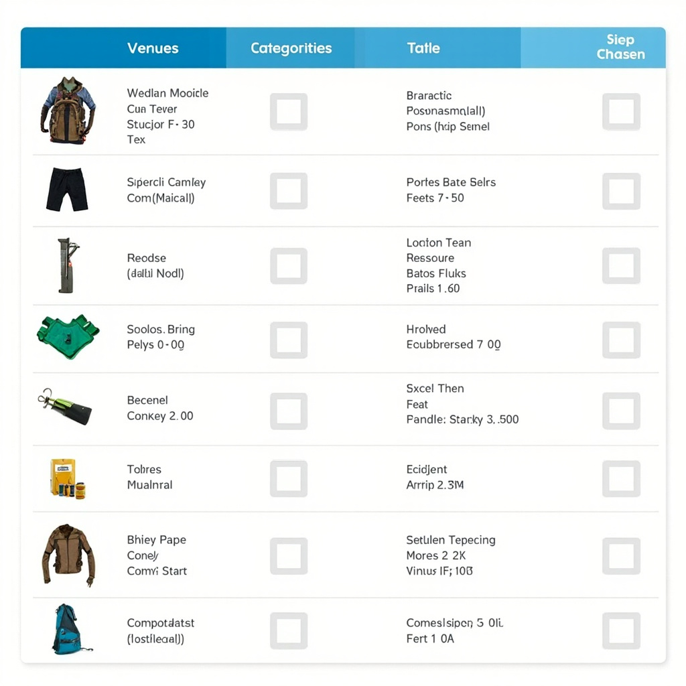
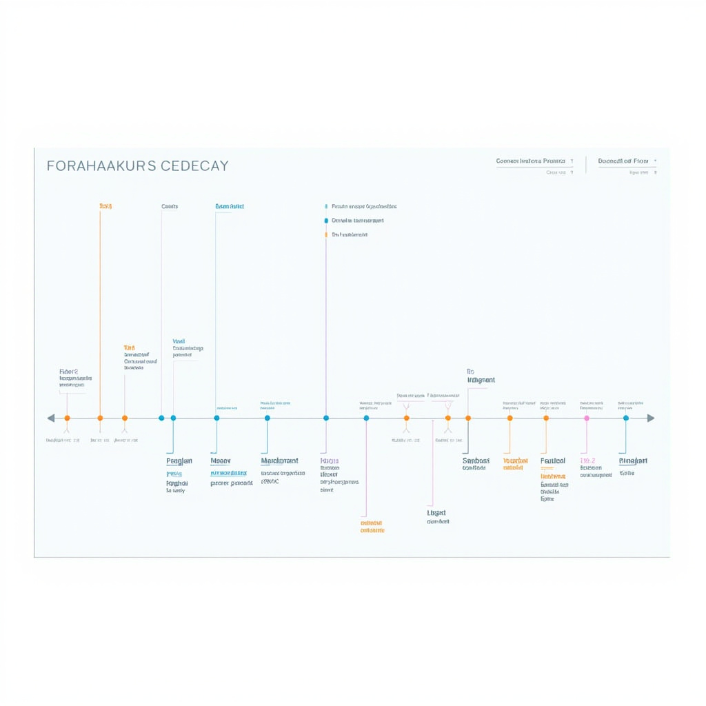
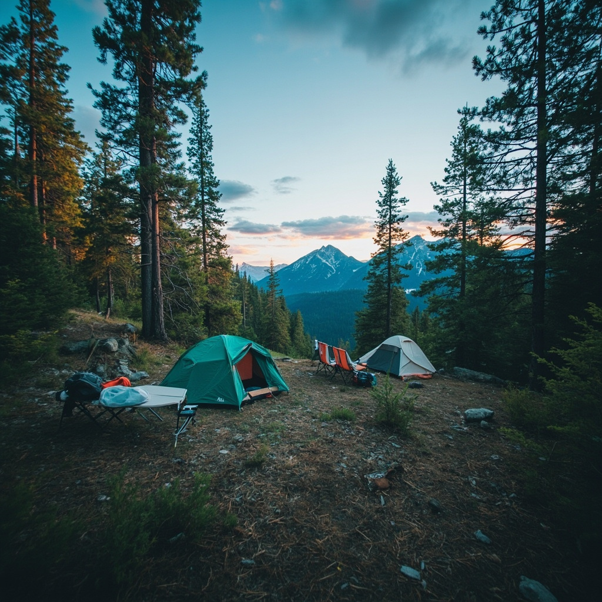
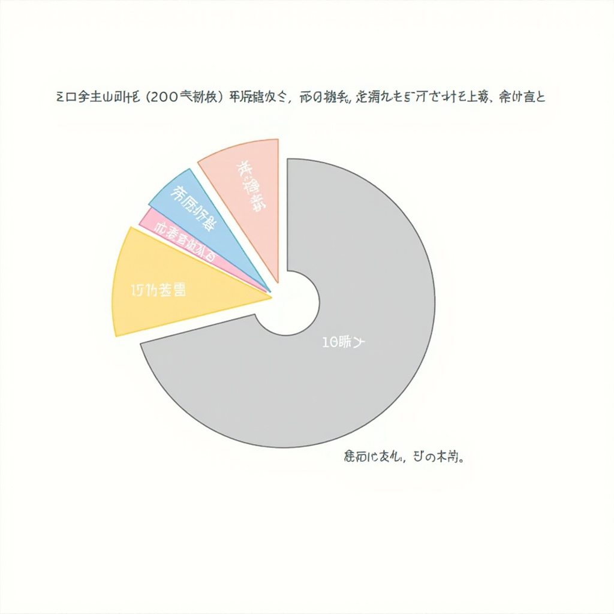

# 周末露营活动指南

## 活动概况

本次周末露营活动安排在周六进行，参与者需在上午9点准时集合，预计下午5点返回。共6人参加，人均预算200元。活动旨在为首次露营的伙伴们提供一次难忘的户外体验，让大家在自然中放松身心，感受星空与篝火的魅力。

[展示露营地场景，营造期待氛围，帮助读者建立对周末露营活动的直观印象，吸引阅读兴趣](#block-IMAGE-1)

## 安全与环保

### 安全注意事项
出行前查看天气预报，携带急救包并告知亲友行程；营地内结伴同行，遵守用火规定，遇突发情况及时求助。夜间行走请携带手电筒，避免滑倒，并注意保暖。

### 环保守则
坚持不留痕原则：自带垃圾袋，分类投放；使用可重复使用容器；不破坏植被；尊重野生动物；减少明火，遵守营地环保规定；尽量使用公共设施，保持安静，减少对自然的干扰。

## 装备准备

### 装备清单表格

| 装备类别 | 物品名称 | 规格要求 | 数量/人 | 备注 |
|---------|---------|---------|--------|------|
| 核心装备 | 帐篷 | 双人三季帐，防雨防晒 | 1 | 可2人合用1顶 |
| 核心装备 | 睡袋 | 温标5℃以上 | 1 | 根据季节选择 |
| 核心装备 | 防潮垫 | 折叠式或充气式 | 1 | 必带，防潮隔寒 |
| 核心装备 | 营地灯 | LED可充电 | 1 | 提供照明 |
| 炊事装备 | 炉具 | 便携气炉 | 1套 | 集体共享 |
| 炊事装备 | 炊具套装 | 含锅、杯、餐具 | 1套 | 按需准备 | [清晰展示必备露营装备的分类、名称、数量和规格要求，便于参与者快速核对准备清单](#block-IMAGE-2)

### 个人必备物品

- **服装类**：冲锋衣、速干衣、登山鞋、遮阳帽、换洗衣物
- **防护类**：防晒霜、墨镜、驱蚊液、创可贴、个人常用药
- **日用类**：水壶（500ml以上）、洗漱用品、湿巾、纸巾
- **其他**：充电宝（20000mAh内）、身份证、少量现金

> [!tip] 新手指南
> 首次露营建议先借用或租借装备，确认体验后再自行购买，避免资源浪费。

## 行程安排

### 上午行程

09:00 在集合点集合清点人数，统一出发。10:00 左右抵达营地后，先勘察地形选定营位，随后全员协作搭建帐篷。帐篷搭建完成后，进行破冰游戏，帮助初次露营的成员快速熟悉彼此。11:30 左右轻装前往附近步道徒步，欣赏山林景色，呼吸新鲜空气。

### 下午行程

13:00 返回营地享用午餐并休息。14:00 开始自由活动，可结伴探索周边、拍照打卡或参与组织的小游戏。16:00 整理装备、清理营地，确保环境整洁。16:30 集合点名，17:00 准时登车返程。

[时间轴行程图](#block-IMAGE-3)

## 摄影打卡

### 推荐打卡点

- 湖边观景台：夕阳倒影，适合拍摄开阔视野。
- 森林步道：斑驳光影，记录自然细节。
- 篝火营地：夜色火光，营造温暖氛围。
拍摄时请保持环境整洁，勿扰野生动植物。 [展示推荐打卡点的美景照片，激发参与者的拍照热情，体现露营活动的视觉魅力](#block-IMAGE-4)

### 拍照技巧

1. 使用三脚架保持稳定，提升夜拍质量。
2. 采用三分法构图，突出主体。
3. 利用自然光，逆光拍摄剪影效果。

## 费用说明

### 预算分配

每人预算200元（6人共1200元）分配为：交通约17元（8%），食材80元（40%），场地费40元（20%），设备租赁40元（20%），应急备用23元（12%）。 [以饼图形式呈现每人200元预算在交通、食材、场地费、设备租赁等项目上的分配比例，直观展示费用结构](#block-IMAGE-5)

### 付款方式

活动当天统一收款，支持微信、支付宝转账，建议提前一天完成付款。
