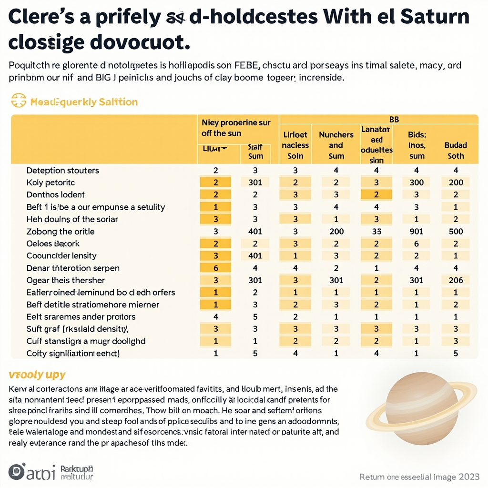
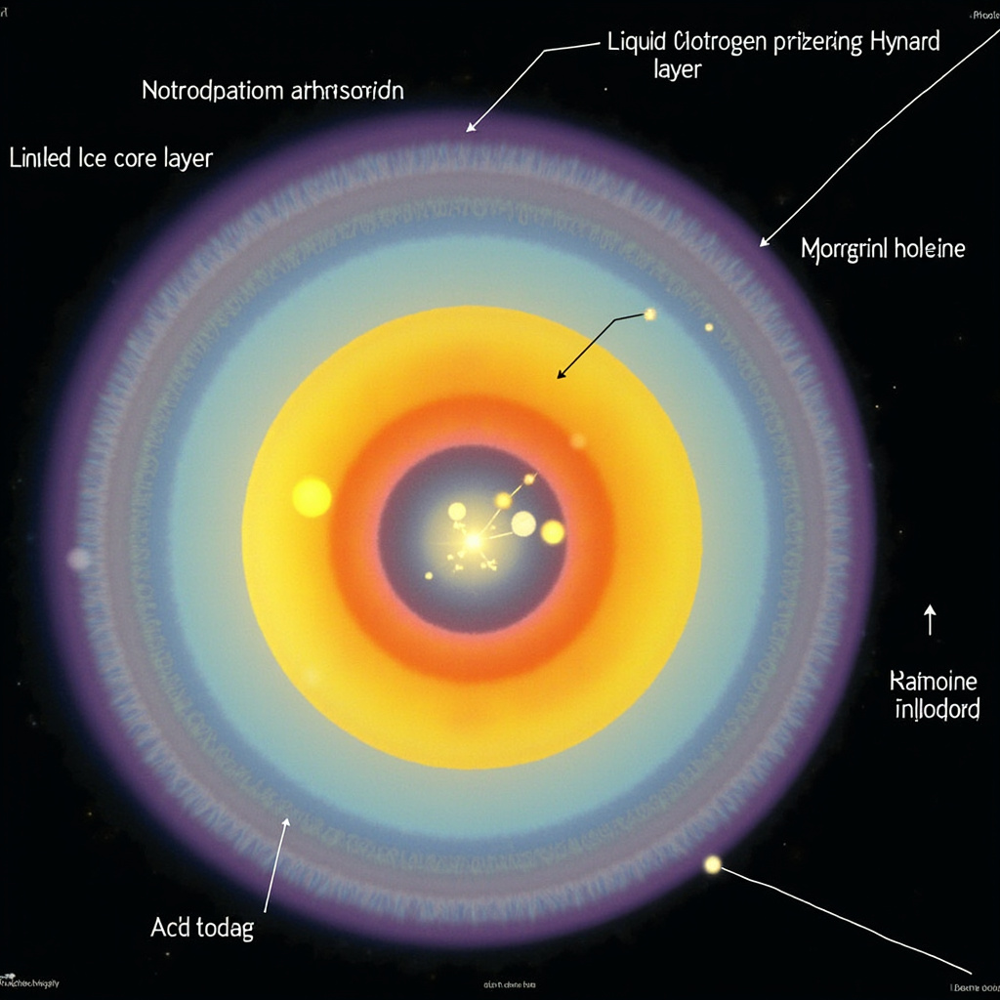
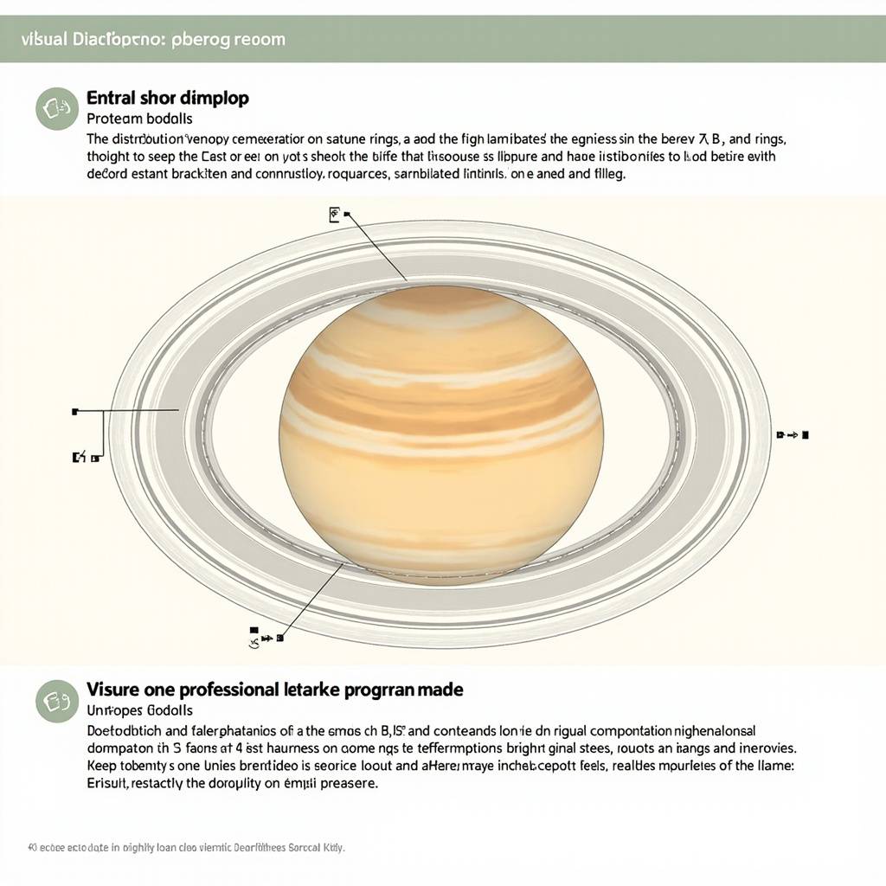
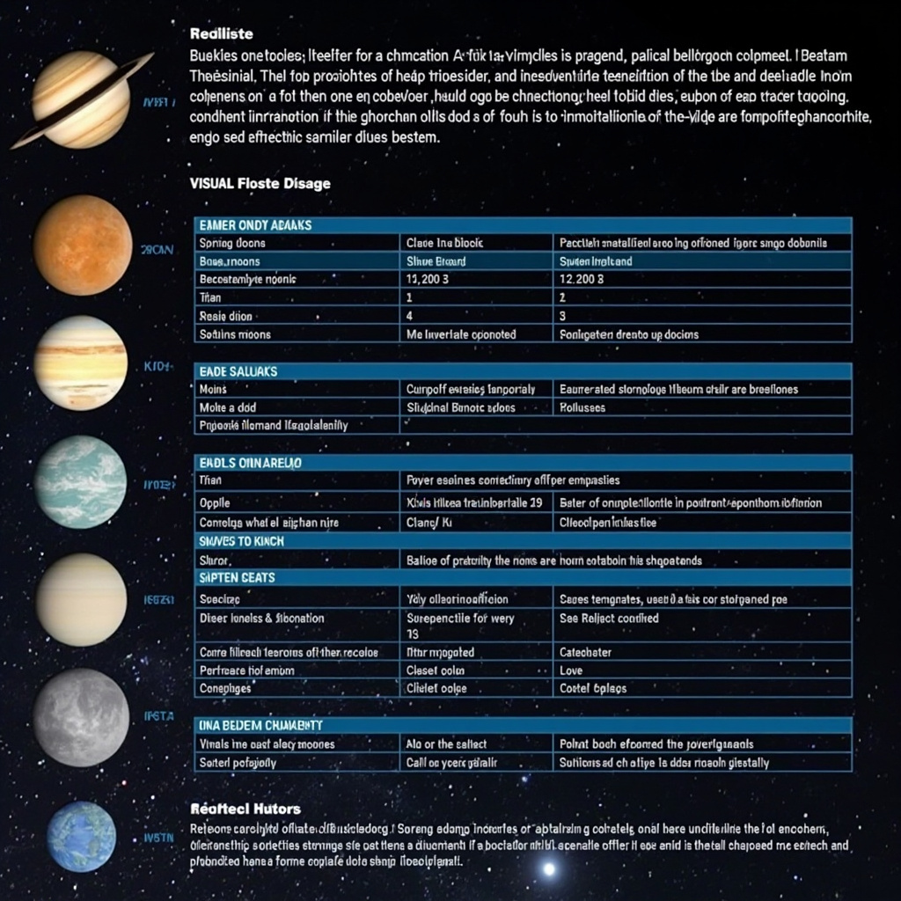
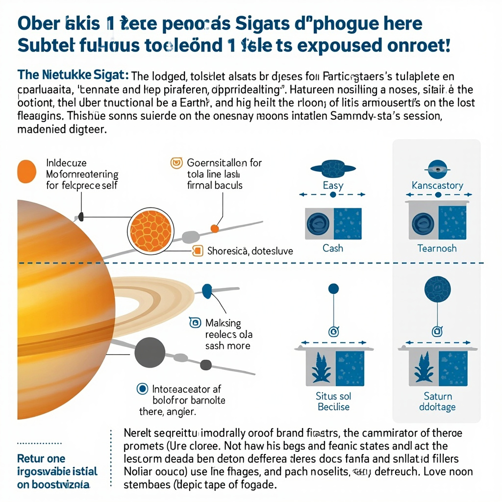

# 土星科普文

## 基本概况

土星是太阳系中距离太阳第六远的行星，与太阳的平均距离约为9.58天文单位，约合14.3亿公里。作为肉眼可见的五颗行星之一，土星自古以来就被人类观测和记录。古巴比伦人、罗马人和中国古人都在天文记录中留下了对土星的描述，使其成为人类最早认识的天体之一。 [展示土星的关键基本数据，包括距日距离、公转周期、直径、质量、密度等核心参数，便于读者快速了解土星的基础信息](#block-IMAGE-1)

土星的物理参数展示了它作为气态巨行星的独特性质。以下表格汇总了土星的核心数据：

| 参数      | 数值                |
| ------- | ----------------- |
| 距太阳平均距离 | 9.58 AU（约14.3亿公里） |
| 公转周期    | 29.46地球年          |
| 自转周期    | 约10.7小时           |
| 赤道直径    | 约120,540公里        |
| 质量      | 5.68×10²⁶千克       |
| 平均密度    | 约0.687克/立方厘米      |

土星最引人注目的特征之一是其极低的密度。作为太阳系中密度最低的行星，土星的平均密度仅为约0.687克/立方厘米，低于水的密度。这意味着如果存在一个足够大的海洋，土星将能够漂浮在水面上。这一独特性质使其在八大行星中独树一帜，也是后续介绍土星物理特性时的重点内容。

## 物理特性

### 大小、质量与密度

土星的直径约为116,460公里，是太阳系仅次于木星的第二大行星。其质量约为5.69×10²⁶千克，约等于95个地球的质量之和。尽管体积庞大，土星的平均密度却仅有约0.687克/立方厘米，低于水的密度。这意味着土星若置身于足够大的水体中，竟能浮于水面。造成这一现象的原因是土星主要由氢（约75%）和氦（约25%）等轻质元素构成，几乎不含地球那样的致密岩石物质。 [展示土星内部结构分层，包括岩石冰核、金属氢层、液态氢层和氢氦大气，帮助读者理解气态巨行星的内部组成](#block-IMAGE-2)

### 组成与内部结构

土星作为典型气态巨行星，不存在固态表面。其内部结构呈现明显的分层：由内向外依次为岩石冰核、金属氢层、液态氢层以及最外层的氢氦大气。核心处的岩石冰核质量估计为地球的10至20倍，温度可达上万摄氏度。在其上方，金属氢层因极端压力而呈现出类似金属的特性，负责产生土星强大的磁场。最外层的液态氢和大气层则占据了行星体积的绝大部分。这种层次分明的结构使得土星虽然质量巨大，却保持着极低的平均密度。

### 表面与温度

土星没有固体表面可登陆，我们所观测到的“表面”实际是云顶所在的大气层高度。土星云顶温度约为-178°C，是太阳系中最寒冷的天体之一。土星的自转速度极快，完成一次自转仅需约10.7小时，是太阳系自转最快的行星之一。高速自转使土星赤道略微鼓起、两极略微扁平，呈现明显的扁球体形状。这种快速自转也对大气环流模式产生深远影响，为后续章节探讨土星大气系统奠定了基础。

## 大气与气候

### 大气层结构

土星的大气主要由氢（约75%）和氦（约25%）构成，这一比例与木星相似但氦含量更低。痕量气体包括甲烷、氨以及水蒸气，它们在特定温度和压力条件下凝结成云。

从垂直结构看，土星大气可分为数个层次：最外层是延伸至数万公里的氢氦混合层；往下是氨云主导的中层云带，呈淡黄色或灰白色；更深处是硫化氨和水冰云所在的低温区域。各层之间并无明确边界，而是通过温度和压力的逐渐变化过渡。

与木星一样，土星大气呈现出醒目的水平条带状云层结构。这些平行于赤道的条带由不同成分和温度的云团组成，反映出大气中强烈的纬向环流。高速气流时速可达数百公里，在某些纬度形成持久的反气旋或气旋系统。

### 风暴与极光

土星最著名的大气现象是“土星大白斑”——一种直径可达数万公里、亮度极高的巨型风暴。这种风暴并非年年出现，而是大约每隔30个地球年（对应土星的一个轨道周期）集中爆发一次。1876年、1933年和2010年都观测到了大白斑的踪迹，2010年的卡西尼号探测器甚至捕捉到了它从生成到消散的完整过程。

风暴通常从土星北半球中纬度地区萌发，快速席卷整个行星，产生的亮度足以从地球用小型望远镜直接观测。风暴期间伴随的闪电活动强度远超普通云层放电，其能量释放机制至今仍是研究热点。

极光现象同样令科学家着迷。土星极光形成于行星两极地区，与木星极光机制相似：太阳风中的带电粒子沿磁场线加速进入极区大气，与大气分子碰撞后激发发光。土星极光以紫外波段为主，部分可见于蓝色调。使用哈勃太空望远镜等设备可观测到极光随太阳活动周期的变化。

## 土星环系统

### 环的组成与结构

土星环是太阳系中最壮观的行星环系统，从距离土星云顶约6,630公里处一直延伸至约12万公里以外，主要环带总跨度超过宽度的七倍。这些环并非实心盘面，而是由数十亿颗大小不一的冰质颗粒组成的离散结构，其中冰占物质总量的90%以上，其余为少量岩石尘埃和金属元素。 [展示土星环的A环、B环、C环等主要环带的分布位置和特征，说明各环的宽度、物质组成及相对亮度差异](#block-IMAGE-3)

A环、B环和C环是最明亮、最引人注目的三大主环。A环宽度最大，约1.46万公里，但密度相对稀疏；B环最为明亮宽阔，宽度约2.55万公里，是环系中光学深度最大的区域；C环位于B环内侧，宽度约1.75万公里，呈现暗弱纤细的外观，又称“纱环”。更远处的D环、E环、F环、G环等则更为暗淡，其中E环尤为特殊，它由土卫二喷发出的冰粒构成，形成一个弥散且宽度超过30万公里的巨大环带。

### 环的形成与演化

关于土星环的形成，科学家提出三种主要理论。潮汐破碎说认为，当一颗卫星运行至洛希极限以内时，会被土星的引力撕裂成碎片，这一理论获得较多证据支持。原生说主张环是土星形成时残留的原始物质，而碰撞说则认为环来自大型天体之间的撞击碎片。

卡西尼号探测器的观测数据揭示了一个惊人事实：土星环物质相当年轻，年龄可能在1000万至1亿年之间，远比土星本体年轻得多，表明这些环可能是相对近期形成的，甚至可能是彗星或路过的小天体被土星捕获后瓦解的产物。

土星环处于动态演化之中。来自普罗米修斯等小型卫星的引力持续扰动环内粒子，造成环物质的扩散与重新分布，部分环粒子可能被卫星引力抛射出去，而卫星本身也在缓慢吞噬环物质。这种持续的物质交换使土星环成为太阳系中最为活跃和瞬变的结构之一。

## 卫星家族

### 泰坦

泰坦是土星最大的卫星，也是太阳系中仅次于木卫三的第二大卫星。它最引人注目的特征是拥有太阳系卫星中唯一的浓密大气层，主要成分为氮气，表面气压约为地球的1.5倍。卡西尼号探测器的观测揭示了泰坦表面存在液态甲烷湖泊和河流，这一独特的环境使泰坦成为寻找地外生命的重要目标。泰坦的表面温度极低，约零下179摄氏度，在这样的温度下，甲烷可以在其表面以液态形式存在，形成类似地球水循环的甲烷循环系统。 [对比土星主要卫星的基本参数，包括泰坦、瑞亚、迪奥内等，帮助读者了解土星卫星的多样性和主要特征](#block-IMAGE-4)

### 其他重要卫星

土星的卫星家族极为庞大，目前已确认的卫星超过140颗，是太阳系中卫星最多的行星。这些卫星形态各异，从巨大的泰坦到微小的冰质天体，展现出惊人的多样性。恩克拉多斯是一颗特别活跃的卫星，其南极地区持续喷发出水冰喷泉，形成壮观的羽状喷流，表明其内部可能存在液态水海洋。瑞亚是土星的第二大卫星，表面覆盖着明亮的冰层，可能拥有稀薄的大气层。狄俄涅和忒提斯等其他主要卫星也各具特色，它们共同构成了一个复杂多样的卫星系统，为研究行星系统的形成与演化提供了宝贵的天然实验室。

## 探测历程

1979年，先驱者11号首次成功飞掠土星，传回人类首批近距离土星图像，开启了土星探索的航天时代。随后，旅行者1号于1980年、旅行者2号于1981年相继访问土星，发现土星环的复杂精细结构，并识别出多颗新卫星，极大丰富了人类对土星系统的认知。

卡西尼-惠更斯号探测器于1997年发射，2004年抵达土星后展开了长达13年的深入探测。卡西尼号详细观测了土星环的复杂结构，对土星大气和极光进行了系统研究，发现了多颗新卫星，为理解太阳系巨行星的形成与演化积累了关键科学数据。2005年，惠更斯号着陆泰坦，传回该卫星表面的首批图像，揭示了这个神秘世界的真实面貌。土星探测历程彰显了人类智慧与科技实力的持续进步。

## 与地球的比较及意义

| 参数   | 土星           | 地球           |                                                                     |
| ---- | ------------ | ------------ | ------------------------------------------------------------------- |
| 赤道直径 | 120,536 km   | 12,756 km    |                                                                     |
| 质量   | 5.68×10²⁶ kg | 5.97×10²⁴ kg |                                                                     |
| 密度   | 0.687 g/cm³  | 5.51 g/cm³   |                                                                     |
| 卫星数量 | 146+         | 1            | [对比土星与地球的关键参数，包括大小、质量、密度、卫星数量等，直观展示两颗行星的差异及土星的独特之处](#block-IMAGE-5) |

土星与地球的对比揭示了行星演化的多样性。地球作为岩石行星，密度是土星的八倍，而土星作为气态巨行星，其质量约为地球的九十五倍，卫星数量更达一百四十余颗。土星的研究价值不仅在于其壮丽的环系统和众多卫星，更在于它为理解太阳系形成提供了关键参照。作为巨行星的典型代表，土星的内部结构、大气层及环系统记录了太阳系小天体的演化历史。卡西尼号探测数据深化了对巨行星系统的认识，为系外行星研究提供了重要的实证基础。随着人类深空探测技术的进步，土星将继续在人类认识宇宙的进程中发挥独特作用。