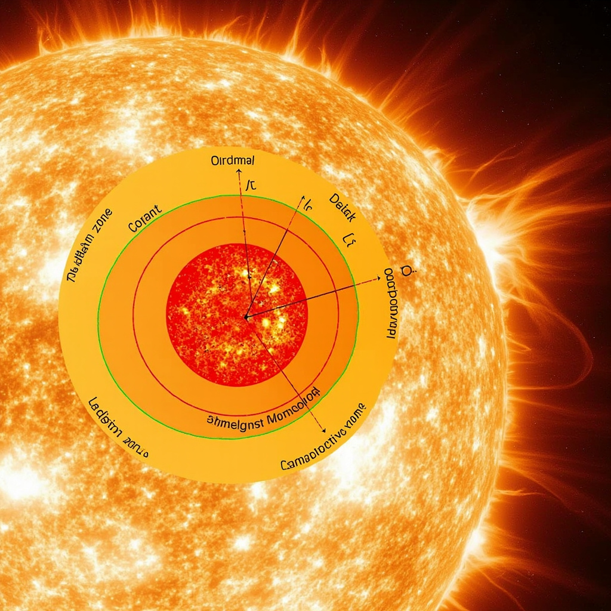
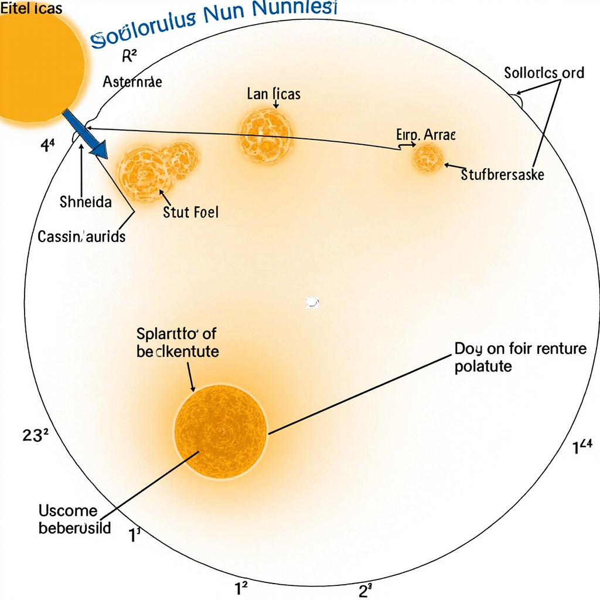

# 太阳科普文章

## 太阳概述

太阳是一颗G2V型黄矮星，也是太阳系的中心天体。在浩瀚的银河系中，它只是一颗普通的中年恒星，位于银河系猎户臂内侧，距离银河系中心约26,000光年。太阳距离地球约1.5亿公里，光线从太阳表面到达地球大约需要8分钟。作为太阳系中最大的天体，太阳的质量占整个太阳系总质量的99.86%，其巨大的引力牢牢束缚着八大行星、矮行星、小行星、彗星等天体，使它们在各自的轨道上有序运行。

太阳对地球生命的重要性再怎么强调都不为过。太阳为地球提供了光和热，是地球生命最主要的能量来源。植物通过光合作用将太阳能转化为化学能，释放出氧气，为几乎所有陆地和水生生物的生存奠定了基础。同时，太阳驱动了地球的大气循环和海洋洋流，调节着全球气候，使地表温度维持在适宜生命繁衍的范围内。没有太阳的光照和热量，地球将陷入永恒的黑暗与寒冷，生态系统也将彻底崩溃。

人类对太阳的观测和研究有着悠久的历史。早在数千年前，古巴比伦人、古埃及人和中国古代天文学家就开始记录太阳的位置变化和日食现象，编制历法，指导农耕。1610年，伽利略使用望远镜观测太阳黑子，开创了科学观测太阳的先河。此后，随着天文望远镜、光谱分析、射电观测和空间探测技术的不断发展，人类对太阳的认知日益深入。如今，多颗太阳观测卫星在太空昼夜监测太阳活动，为人类预测空间天气提供关键数据。

## 太阳的结构与物理特性

在深入了解太阳的内部结构之前，需要先对太阳的基本参数有所认识。作为一颗G2V型主序星，太阳的质量约为1.989×10³⁰千克，体积相当于130万个地球，而表面有效温度约为5778开尔文。这些数据构成了理解太阳物理特性的基础。 [展示太阳的内部层次结构，包括核心、辐射层、对流层以及大气各层的位置和关系，帮助读者直观理解太阳的物理构造](#block-IMAGE-1) [引用前一节中关于太阳基本数据的描述，建立信息连贯性](#block-sec-001)

### 太阳的核心与能量产生

太阳的核心是整个恒星系统中最为极端的物理环境所在。在那里，温度达到约1500万摄氏度（1.5×10⁷ K），压力更是高达约2500亿大气压。在如此苛刻的条件下，物质不再以我们熟悉的气态、液态或固态形式存在，而是处于等离子体状态——原子核与电子相互分离，自由运动。

正是在这个核心区域，太阳的能量产生机制得以运行。太阳能量的主要来源是氢核聚变（pp链反应），即四个氢原子核（质子）在极高温度和压力下，通过一系列复杂反应逐步融合为一个氦原子核。这一过程涉及两次质子转化为中子的β+衰变、两次正电子与电子的湮灭，以及两次中微子的释放。根据爱因斯坦的质能关系E\=mc²，每一次完整的pp链反应都会将约0.7%的质量转化为能量，主要以伽马射线光子的形式释放。

这些伽马射线光子的初始能量极高，但它们并不能直接冲向太阳表面。在向外传播的过程中，光子不断与周围稠密等离子体中的带电粒子发生碰撞，被吸收再发射，方向随机改变。这一过程导致能量传递效率极低——一个光子从核心到达表面可能需要数万甚至数十万年的时间。这种漫长而复杂的能量传输方式，正是理解太阳内部结构的关键所在。

### 辐射层与对流层

太阳内部从核心边缘向外延伸约0.7个太阳半径的区域被称为辐射层。在这个层次中，能量的主要传输方式已经从核心的核聚变反应转变为辐射传递。辐射层的温度从核心的约1500万摄氏度逐渐下降到约200万摄氏度，物质密度也随之急剧降低。

在辐射层中，光子主要通过辐射热传导的方式向外传递能量。伽马射线光子在穿越这一层时，不断被吸收、散射和再辐射，其波长逐渐从高能伽马射线延伸到X射线、紫外线乃至可见光。整个传递过程极其缓慢，平均而言，一个光子在辐射层中需要约10万至100万年才能完成穿越。这种缓慢的能量传递速率意味着，太阳核心产生的热量需要相当长的时间才能到达表面并释放到太空中。

当辐射层向外延伸到约0.71至0.86个太阳半径的范围时，温度梯度变得足够大，使得物质不再稳定于纯辐射平衡状态。此时，对流层接管了能量传输的主导权。在对流层中，温度梯度超过了绝热递减率，导致等离子体在受热膨胀上升与冷却收缩下降之间形成大规模的对流运动。这些对流元胞可以大到横跨数万公里，在太阳表面形成我们所观测到的米粒组织（granulation）和超米粒组织（supergranulation）。

对流层的能量传输效率远高于辐射层。通过等离子体的宏观流动，热量得以快速从内向外传递。当这些炽热的等离子体上升到光球层底部时，它们将能量以光辐射的形式释放到太空中，形成我们所接收到的太阳光。而冷却后的等离子体则下沉回对流层底部，准备再次被加热上升。这种持续的对流循环维持着太阳大气的能量平衡。

### 太阳大气的分层结构

太阳的大气层与地球大气有着本质的不同，它并非一个连续均匀的气体壳层，而是由性质截然不同的三层组成：光球层、色球层和日冕。这三层在温度、密度和物理特性上呈现出惊人的差异，尤其是日冕的高温现象至今仍是太阳物理学的未解之谜。

光球层是我们通常所说的太阳表面，也是太阳辐射的主要来源层。光球层的厚度约为400公里，温度从底部的约6600开尔文下降到顶部的约4400开尔文。我们所看到的太阳圆面就是光球层的可见光辐射。在高分辨率观测下，光球层呈现出复杂的颗粒状结构——米粒组织，每个米粒的直径约为1000公里，寿命仅几分钟。这些米粒是对流层热对流在光球层的直接表现，代表着炽热等离子体从内部上涌到表面并释放能量后下沉的过程。

光球层之上是厚度约2000公里的色球层。由于色球层的密度极低，其辐射强度远低于光球层，平时被光球的明亮光芒所掩盖，只有在日全食期间或使用特殊滤光器时才能观测到。色球层的温度结构十分特殊：它并不像大气层那样随高度递减，而是先从光球顶部的约4400开尔文下降到约3800开尔文（温度极小区），随后急剧上升，在色球层顶部达到约20000开尔文。这种温度反转现象表明，存在某种额外的加热机制在色球层中发挥作用。

日冕是太阳大气的最外层，延伸至数百万公里的行星际空间。日冕的密度极低，比地球上最好的实验室真空还要稀薄数个数量级。然而，日冕的温度却高得令人震惊——可达100万至300万开尔文。这就是著名的“日冕加热问题”，即离太阳核心更远的日冕为何比直接相邻的光球层温度高出数百倍。

关于日冕高温现象，目前存在多种理论解释。波动加热理论认为，对流层和色球层的等离子体运动产生阿尔芬波等磁流体波，这些波沿着太阳磁场向上传播并最终将能量沉积在日冕中。磁重联理论则认为，色球层中密集的磁场结构之间不断发生重联事件，释放出的磁能加热了周围的日冕物质。无论哪种机制占主导，日冕加热问题都提醒我们，太阳的物理特性远比表面上看起来复杂得多。

日冕在可见光波段极为暗淡，但在极紫外和X射线波段却异常明亮。这是因为日冕中的高温等离子体主要发射高能辐射。观测显示，日冕并非均匀分布，而是呈现出复杂的结构：冕洞区域磁场开放，辐射较弱；冕环和冕流则对应着闭合磁场区域，形成壮观的等离子体弧拱。这些结构与太阳磁场紧密相连，体现了太阳大气中磁流体动力学的核心作用。

## 太阳活动现象

太阳表面并非一成不变的宁静之地，而是充满了剧烈的动态活动。这些活动主要集中在太阳的大气层中，尤其是色球层和日冕层，与太阳磁场的变化密切相关。根据前一节对太阳大气分层结构的介绍，可以理解这些活动现象发生在特定的层次之中。 [展示太阳黑子、太阳耀斑、日冕物质抛射等太阳活动现象的位置和特征，补充文字描述的空间分布信息](#block-IMAGE-2) [引用太阳大气分层结构，解释太阳活动现象发生在哪一层及其与磁场的关系](#block-sec-002)

### 太阳黑子与太阳周期

太阳黑子是光球层上最为明显的活动现象，表现为温度相对较低的暗区。太阳光球的平均温度约为5778开尔文，而黑子中心的温度通常在3000至4500开尔文之间。由于黑子的温度较低，它们在明亮的光球背景下呈现为暗斑，但这只是相对而言——如果将黑子单独取出，其亮度仍然超过大多数恒星的表面。

黑子的形成与太阳磁场密切相关。当太阳内部的磁力线因等离子体运动而被扭曲并上升到光球表面时，会抑制该区域的对流热传递，导致温度下降从而形成暗区。太阳黑子通常成对出现，代表着磁力线进出太阳表面的位置，其极性分布遵循特定规律。

更为引人注目的是太阳黑子数量的周期性变化。天文学家通过长期的观测记录发现，黑子数量呈现出约11年的准周期波动，这一规律被称为太阳黑子周期或太阳活动周期。在一个周期的极大期，太阳表面可能出现数十甚至上百个黑子群，同时伴随频繁的耀斑活动；而在极小期，可能连续数周都看不到任何黑子。

这一周期不仅影响黑子数量，还与太阳的整体活动水平密切相关。太阳周期反映了太阳内部磁场翻转和重建的过程。当一个周期结束时，太阳磁极会交换位置，需要再经过约11年才能恢复到初始极性。太阳周期的变化会影响太阳辐射输出的微小波动，对地球的空间环境和气候可能产生长期影响。

### 太阳耀斑与日冕物质抛射

当太阳活动达到高峰期时，其大气层中会爆发出更为剧烈的能量释放现象。太阳耀斑是色球层中突然出现的亮度激增，是太阳局部区域储存的磁能被快速释放的过程。一次大型耀斑可以在数分钟内释放相当于数百亿颗氢弹爆炸的能量，主要以电磁辐射的形式向外传播。

耀斑根据其强度分为多个等级，常用的是基于X射线亮度的分类系统。A级最弱，B、C、M级逐级增强，而X级耀斑的强度可达M级的十倍以上。强烈的耀斑事件能够引发电离层扰动，影响短波通信和导航信号。

日冕物质抛射是另一种更为宏大的太阳活动现象。当太阳日冕中的磁结构因能量积累而失稳时，会将大量等离子体和磁场以极高的速度抛向行星际空间。这些物质云的质量可达数十亿吨，抛射速度从每秒数百公里到超过三千公里不等。

日冕物质抛射与太阳耀斑虽然常常同时发生，但二者的物理过程并不完全相同。耀斑主要是电磁辐射的能量释放，而日冕物质抛射则是大量物质的动力学抛射。当这些抛射物朝向地球时，可能在一至三天内抵达地球空间环境，与地球磁层相互作用，引发地磁暴等空间天气事件。太阳耀斑和日冕物质抛射共同构成了太阳活动对地球影响的主要途径。

## 太阳对地球的影响

太阳释放的带电粒子流穿越太空抵达地球时，会与地球磁场产生复杂相互作用。当这些高能粒子沿磁力线进入极区大气层，便会激发大气原子产生发光现象，形成壮观的极光。极光主要出现在南北极高纬度地区，但在强烈太阳活动期间，其可见范围可延伸至中纬度地区，甚至在某些极端事件中出现在更低纬度。 [引用太阳耀斑和日冕物质抛射的具体描述，说明哪些活动现象直接导致地球受到影响](#block-sec-003)

太阳活动对人类技术系统构成显著威胁。带电粒子干扰无线电信号传播，导致通信质量下降或中断。卫星运行受到冲击，导航定位精度下降。地面电力网络在极端事件中可能遭受损坏。历史上，1989年的太阳风暴曾造成加拿大魁北克省大规模停电，影响数百万人。

科学家通过地面观测站和空间探测器构建监测网络，持续追踪太阳活动。这些观测数据帮助研究人员分析太阳黑子数量变化和磁场活动规律。借助现代预警系统，可在太阳风暴发生前数小时至数天发出警报，为关键基础设施运营方争取防护准备时间。

通过技术防护手段和应急机制，人类能够有效降低太阳活动的不利影响。电网运营商可采取防护措施保护变压器，卫星系统可切换至安全模式，航空线路可调整极地航班的飞行路径。随着观测技术进步和预警能力提升，人类应对太阳风暴的能力正在不断增强。