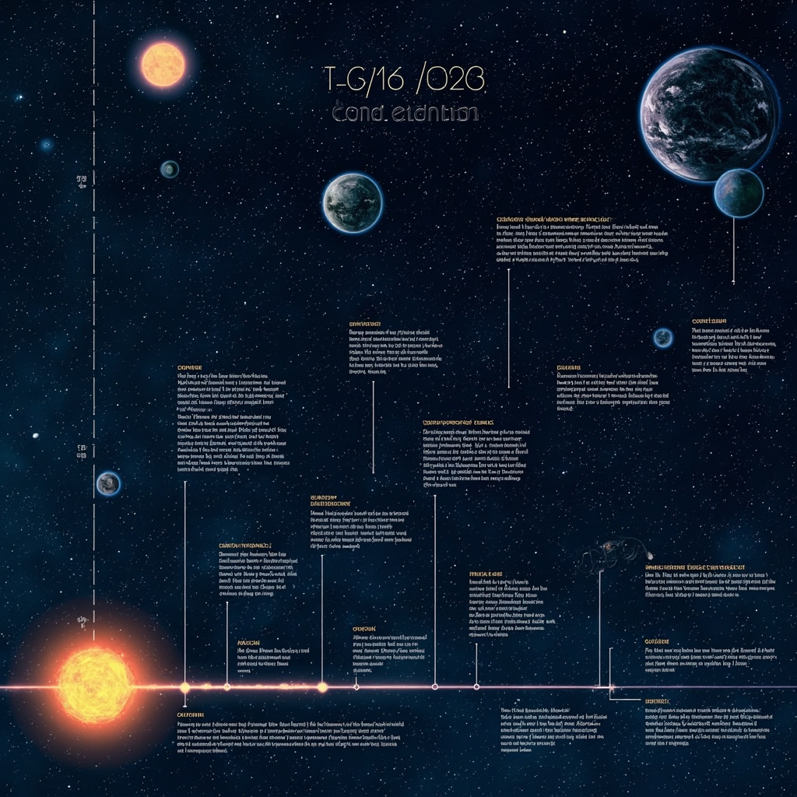
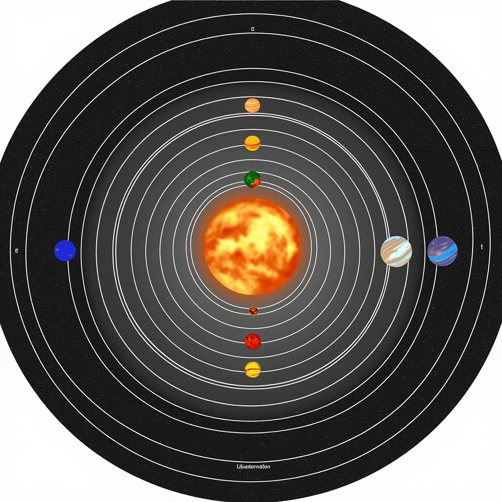
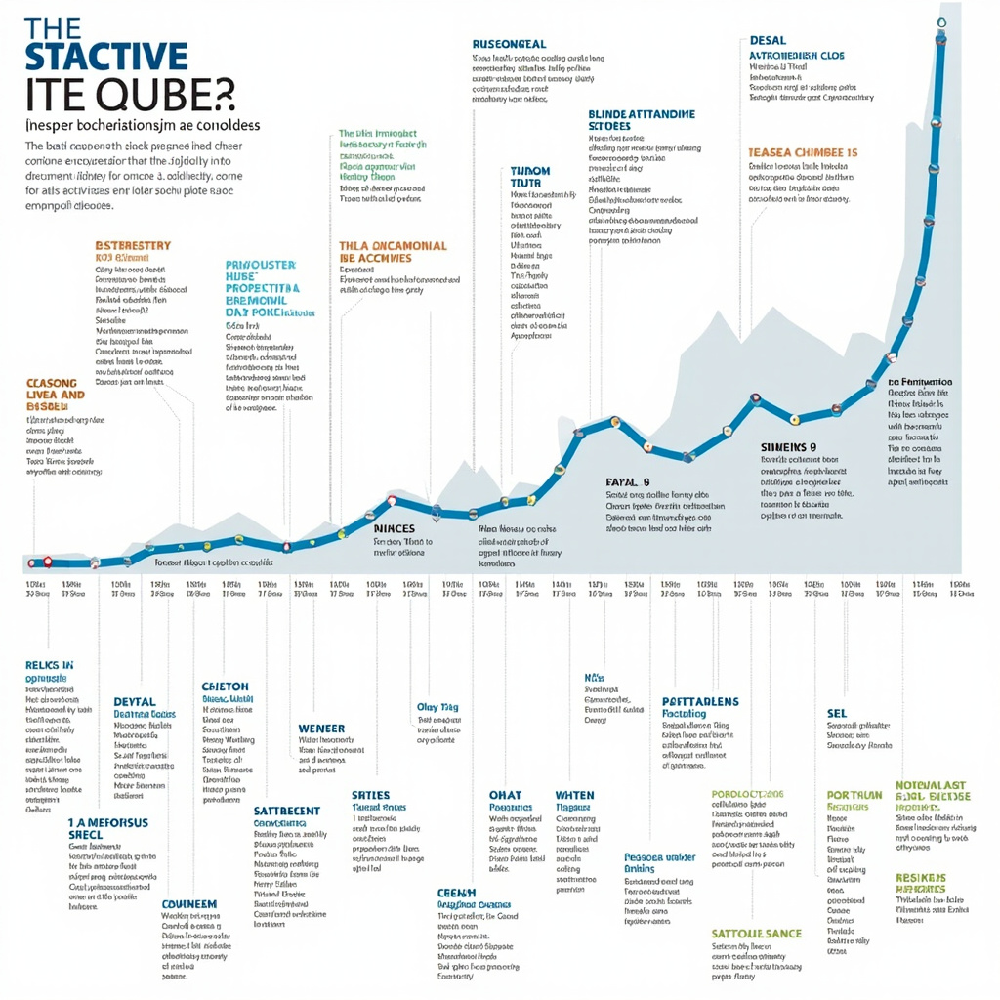

# 宇宙科普

## 宇宙的起源

宇宙从何而来？这是一个人类思考了数千年的根本问题。现代宇宙学给出了迄今为止最具说服力的答案：大爆炸理论。 [展示宇宙从大爆炸至今的演化时间线，帮助读者直观理解宇宙起源和发展的主要阶段](#block-IMAGE-1)

### 大爆炸理论

大爆炸理论认为，宇宙起源于约138亿年前的一次极高温度和密度的初始状态。在那一刻，时空、物质和能量从一种无法完全描述的极端状态中诞生。随着空间本身的急剧膨胀，宇宙开始冷却并逐渐形成我们今天所见的各种结构。这一理论之所以被广泛接受，很大程度上得益于宇宙微波背景辐射的发现——一种遍布全宇宙的微弱热辐射，被认为是宇宙诞生38万年后的残余光辉。

### 宇宙的早期演化

在大爆炸后的最初几分钟内，极端高温环境促成了原初核合成的发生，氢、氦等轻元素在这一时期大量形成。随后，宇宙经历了快速的暴胀阶段，随后进入漫长的冷却期。随着温度持续下降，引力逐渐占据主导，原始物质开始聚集形成了第一批恒星和星系，宇宙的面貌也随之彻底改变。

## 宇宙的结构

银河系是我们所在的星系，在可观测宇宙中数千亿个星系之一。这个庞大的恒星系统包含约2000亿颗恒星，形成了壮观的旋转结构。天文学家将星系分为三大类：椭圆星系、螺旋星系和不规则星系。银河系属于螺旋星系，拥有多条旋臂。

恒星诞生于星际云中，经过漫长的主序星阶段后走向死亡。小质量恒星最终演化为白矮星，而大质量恒星则以超新星爆发的形式结束一生，将重元素抛洒回宇宙空间。

暗物质无法直接观测，却通过引力效应证明了其存在，约占宇宙物质总量的85%。暗能量则更为神秘，它驱动着宇宙加速膨胀，约占宇宙总质能的68%。这两种不可见的成分共同主导着宇宙的命运。

在更大的尺度上，星系并非均匀分布，而是聚集成星系团、超星系团，形成类似纤维状和网状的大尺度结构。这种宏观图景展示了宇宙物质的组织方式。

## 我们的太阳系

太阳的直径约为139万公里，其表面温度约5500摄氏度，而核心温度可达1500万摄氏度。太阳质量占据太阳系总质量的99.86%，是系统的绝对中心。 [展示太阳与八大行星的相对位置和轨道关系，帮助读者建立太阳系结构的直观认识](#block-IMAGE-2)

太阳系拥有八大行星，按照与太阳的距离由近及远分别是水星、金星、地球、火星、木星、土星、天王星和海王星。这些行星分为两类：内太阳系的类地行星（水星、金星、地球、火星）体积较小、密度较高，主要由岩石和金属构成；外太阳系的巨行星（木星、土星、天王星、海王星）则体积庞大、密度较低，主要由气体和冰物质组成。行星在各自轨道上以不同周期围绕太阳公转，距离太阳越近，公转速度越快。

小行星带位于火星与木星轨道之间，含有数百万颗小型天体，直径从数米到数百公里不等，主要由岩石和金属组成。柯伊伯带位于海王星轨道外侧，同样存在大量冰质天体。此外，更远处的奥尔特云据信包围着整个太阳系，其中蕴含大量彗星来源的长周期彗星。

矮行星是指质量足以维持近似球形，但未能清除轨道邻域其他天体的天体。冥王星是矮行星的典型代表，直径约2370公里，2006年被国际天文学联合会正式归类为矮行星。矮行星的界定反映了人类对太阳系天体认识的不断深化。

## 宇宙探索与未来

从古代仰望星空的先民，到如今在太空中留下足迹的人类，探索宇宙的梦想始终激励着文明的进步。1957年，苏联发射了人类第一颗人造卫星——斯普特尼克1号，标志着太空时代的开启。1961年，尤里·加加林成为首位进入太空的人类，完成了人类历史上的首次载人航天飞行。1969年，阿波罗11号任务成功将宇航员送上月球，阿姆斯特朗迈出的那一步至今仍是人类探索精神的永恒丰碑。 [展示人类太空探索的关键里程碑事件，体现探索历程的发展脉络](#block-IMAGE-3)

随后，航天飞机的研制和 国际空间站的建设，让人类能够在太空长期生活与工作。中国航天事业近年来取得了举世瞩目的成就，从“神舟”载人飞船到“天宫”空间实验室，从“嫦娥”探月到“天问”火星探测，中国正大步迈向航天强国的行列。哈勃望远镜和韦伯望远镜的相继升空，为人类打开了观测宇宙的全新窗口，它们捕捉到的遥远星光和星系图像，极大地深化了我们对宇宙结构和演化的认知。在系外行星搜索方面，开普勒望远镜和苔丝卫星等设备已发现数千颗系外行星，其中不乏位于宜居带的类地星球，这让我们对发现地外生命充满了期待。

未来的宇宙研究前沿

展望未来，载人火星任务、月球基地建设乃至小行星采矿已经从科幻走向规划。而暗物质和暗能量的本质、宇宙的终极命运、以及地外生命的寻找，将继续指引科学探索的前进方向。人类对宇宙的探索，既是对未知的勇敢追寻，也是对自身存在意义的深刻思考。
