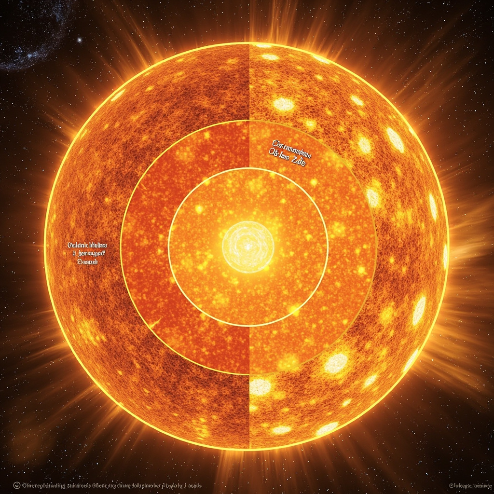
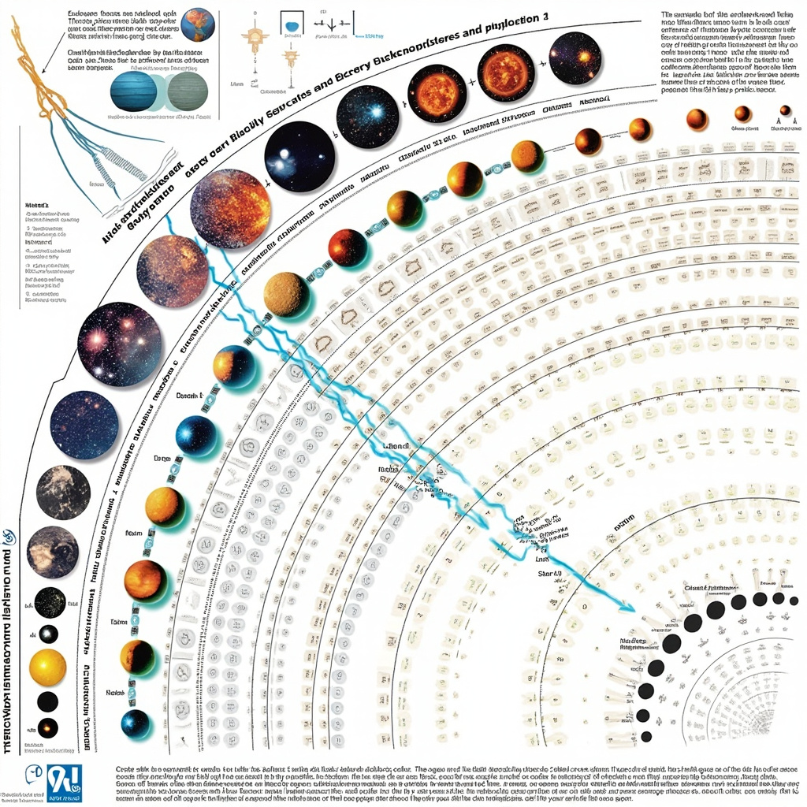

# 恒星科普：了解宇宙的光源

## 什么是恒星

### 恒星的基本定义

恒星是一种通过自身内部核聚变反应产生能量并发光的天体。在恒星的核心，温度可达数百万摄氏度，压力极高，使得氢原子核克服相互之间的静电排斥力，发生聚变反应，转化为氦原子核，同时释放出巨额能量。这些能量以光和热的形式向外辐射，使恒星在宇宙中成为明亮的光源。与行星的本质区别正在于此：行星只能依靠反射恒星的光线来发光，而恒星则能够独立产生并维持自身的能量输出。 [展示恒星的基本结构，包括核心、辐射层、对流层等层次，帮助读者理解恒星内部的物理过程](#block-IMAGE-2)

### 恒星的主要特征

恒星具有几个关键的物理参数。质量是恒星最重要的特征之一，它决定了恒星内部的温度和压力水平，进而影响核聚变的效率和恒星的整体演化路径。太阳的质量约为2×10³⁰千克，而宇宙中已知恒星的质量从太阳质量的约8%到上百倍不等。体积方面，恒星的差异极为悬殊，从比地球还小的中子星到直径超过太阳千倍以上的红超巨星均有存在。光度和表面温度同样呈现巨大差异，表面温度从约2500开尔文的红矮星到超过50000开尔文的蓝巨星不等，温度越高，颜色越偏蓝白。

从内部结构看，恒星通常可分为核心区、辐射层和对流层。核心是核聚变发生的区域，能量在此产生后通过辐射方式逐层向外传输；在某些恒星中，能量传输则依靠对流实现。这一复杂的内部结构是恒星能够长期稳定发光的基础。

### 恒星的观测方法

人类观测恒星的技术手段随着科技进步而不断丰富。光学望远镜是最传统的观测工具，通过收集可见光让天文学家测量恒星的位置、亮度和颜色。射电望远镜则捕捉恒星及星际介质发出的无线电波，揭示光学波段无法直接观测的信息。空间探测器与望远镜，如哈勃空间望远镜和开普勒太空望远镜，能够避开大气层的干扰，获得更清晰、更精确的观测数据。此外，恒星的光谱分析为研究其化学成分、温度和运动状态提供了重要手段。

通过这些观测方法，人类逐步揭开恒星的神秘面纱，为理解恒星如何形成、演化和死亡奠定了观测基础。

## 恒星的生命周期

恒星的形成 [展示恒星从诞生到死亡的完整演化过程，帮助读者直观理解不同质量恒星在各阶段的形态变化及其最终归宿](#block-IMAGE-1)

恒星诞生于宇宙中的分子云。当巨量气体和尘埃在引力作用下开始坍缩，物质不断向中心聚集，密度和温度急剧攀升。坍缩过程中形成的天体被称为原恒星，它继续吸积物质并升温，直到核心温度突破一千万摄氏度，触发氢核聚变，一颗真正的恒星就此点亮。

主序星阶段

核聚变的点燃标志着恒星进入主序星阶段，这是其生命周期中最为漫长且稳定的时期。在主序阶段，恒星通过将氢聚变成氦来产生能量，巨大的引力与向外辐射压力达到平衡，使恒星保持相对恒定的大小和亮度。太阳正是一颗典型的主序星，已在此阶段燃烧了约四十六亿年。

红巨星与末期演化

当核心氢燃料耗尽，中小质量恒星开始向红巨星演化。失去辐射支撑的外层气体急剧膨胀，恒星体积可扩大数百倍，而核心则收缩并升温，继续燃烧残余的氦和更重的元素。最终，恒星抛出外层气体形成行星状星云，核心留下一个致密的白矮星，缓缓冷却直至消亡。

恒星死亡：超新星、白矮星与中子星

大质量恒星的故事则更为剧烈。核心燃料枯竭后，引力迅速占据上风，恒星发生灾难性的坍缩，释放出巨大的超新星爆发。爆发将恒星大部分物质抛向宇宙空间，残余的核心根据质量大小，可能形成直径仅数十公里的中子星，甚至坍缩为连光也无法逃脱的黑洞。不同质量的恒星走过截然不同的演化道路，最终归宿也天差地别。

## 恒星与人类

### 恒星在文化与神话中的角色

自古以来，恒星在人类文化中占据神圣地位。不同文明的神话里，恒星被赋予神性，成为崇拜对象。北斗七星指引方向，牛郎织女的传说承载着人们对星空的浪漫想象。古代航海者依靠恒星导航，农民依据星象制定历法、安排农时。恒星不仅是夜空的装饰，更是人类认识世界、规划生活的重要参照。

### 恒星对科学研究的意义

在现代科学中，恒星是解开宇宙奥秘的关键。通过研究恒星的光谱、亮度变化和运动轨迹，天体物理学家验证了核聚变理论，推算出宇宙的年龄和演化历程。恒星作为宇宙中普遍存在的天体，为理解物质在极端条件下的行为提供了天然实验室。它们的形成、演化和死亡过程，直接影响着宇宙结构的形成与演化。

### 人类对恒星的探索与观测技术

人类对恒星的认识不断深化得益于观测技术的进步。肉眼观测时代，人类记录下恒星的位置和周期变化。望远镜的发明让人类看到更远处的星光。进入太空时代后，哈勃望远镜等空间设备摆脱大气干扰，获得清晰图像。射电望远镜、X射线望远镜等设备则从不同波段揭示恒星的神秘面纱。如今，盖亚卫星正在绘制迄今最精确的银河系恒星地图。
