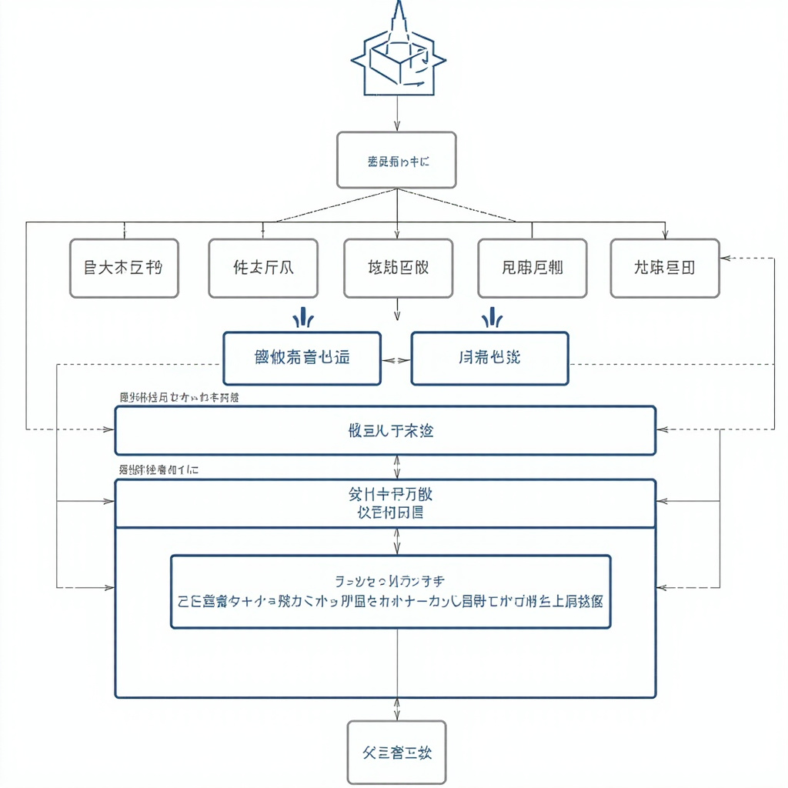
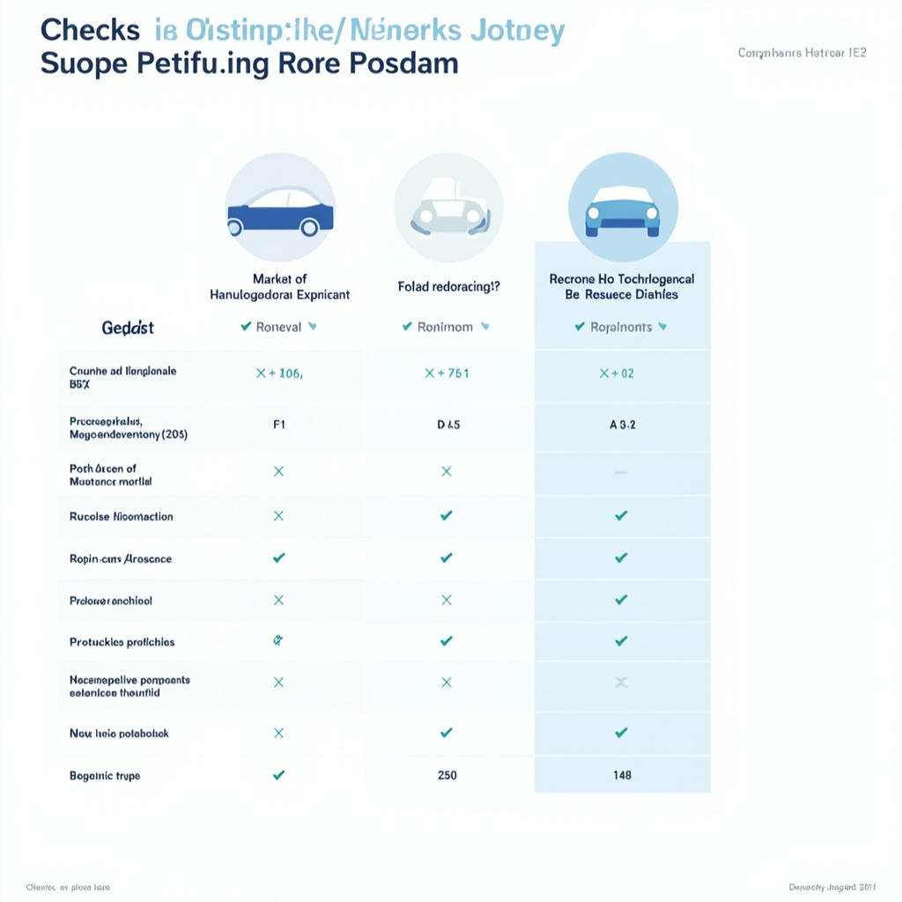

# 新能源汽车产业概述

## 产业概况与发展背景

新能源汽车是指采用新型动力系统，主要或完全依靠电能、氢能等新型能源驱动的汽车。按照动力来源和技术路线，主要分为三类：纯电动汽车完全依靠动力电池供电，插电式混合动力汽车兼具电池驱动和燃油发动机，燃料电池汽车则通过氢燃料电池产生电能驱动。

我国新能源汽车产业发展可划分为三个阶段。2009年至2012年为示范推广期，以公共交通领域为主；2013年至2017年为快速成长期，补贴政策大规模推进，私人消费市场逐步打开；2018年至今进入成熟发展期，补贴逐步退坡，市场化竞争成为主旋律。

在政策层面，国家构建了较为完善的扶持体系，包括车辆购置补贴、免征购置税、免费上牌、充电设施建设补贴等优惠政策，有力推动了产业规模化发展。

产业快速发展的背后存在多重驱动因素。环保压力和碳中和目标使交通领域减排势在必行；能源安全战略要求降低对石油进口的依赖；技术进步使电池成本持续下降、产品性能不断提升。这些因素共同作用，推动新能源汽车从政策驱动向市场驱动转型。

## 核心技术现状

新能源汽车的核心技术体系主要涵盖动力电池、驱动电机、电子控制与智能驾驶四大领域，这些技术相互配合，共同实现新能源汽车的电动化与智能化目标。核心技术架构如图所示的新能源汽车核心技术架构所示，直观展示了各关键技术模块及其协同关系。

动力电池技术是新能源汽车性能的关键决定因素。当前市场主流的锂离子电池技术已相对成熟，三元锂电池凭借其较高的能量密度，在提升整车续航里程方面表现突出，被广泛应用于中高端车型。磷酸铁锂电池则以其优异的安全性能、更低的成本和更长的循环寿命著称，正逐步成为入门级车型和储能系统的主流选择。固态电池作为下一代电池技术的代表，采用固态电解质替代传统液态电解质，理论上可实现更高的能量密度和更好的安全性能，目前正处于从实验室研发向产业化过渡的关键阶段，多家国内外企业已发布相关技术路线图。

驱动电机系统承担将电能转化为机械能的核心任务。永磁同步电机因具有高效率、高功率密度和良好的调速性能，成为当前新能源乘用车的主流配置。异步感应电机则在需要宽速域运行的商用车和部分高性能车型中应用广泛。电机控制器作为连接动力电池与驱动电机的桥梁，通过功率半导体器件实现电能的精确变换和控制，是决定整车动力响应特性的关键因素。

电子控制系统的核心在于整车控制单元（VCU）对车辆运行状态的综合判断与协调控制。电池管理系统（BMS）负责实时监测动力电池的电压、温度、SOC等关键参数，实现电池的均衡管理和热管理，确保电池在安全区间内高效运行。电机控制器（MCU）执行整车控制单元的指令，完成对驱动电机的扭矩和转速控制。当前，域控制器架构和软硬件解耦成为电子控制系统发展的重要趋势，有助于降低整车成本并提升系统可升级性。

智能驾驶技术正从辅助驾驶向高阶自动驾驶加速演进。基于摄像头、毫米波雷达、激光雷达等多传感器融合的环境感知方案，配合高精度定位和路径规划算法，使车辆能够在特定场景下实现自主驾驶。L2级辅助驾驶功能如自适应巡航、车道保持、自动紧急制动等已实现规模化量产应用。城市道路领航辅助驾驶（城市NOA）作为迈向完全自动驾驶的重要里程碑，正在头部车企推动下快速迭代升级。

## 市场格局与主要参与者

中国新能源汽车市场已形成多元竞争格局，2024年国内新能源乘用车渗透率超过50%，市场从政策驱动转向消费驱动，竞争焦点从续航里程拓展至智能化体验与成本控制。根据乘联会数据，比亚迪以超过30%的市场份额稳居行业首位，特斯拉、吉利、长安等品牌紧随其后，市场集中度持续提升。

比亚迪作为国内新能源领军企业，依托垂直整合供应链与磷酸铁锂技术路线，在10万至30万元价格带占据主导地位，产品线从海鸥、海豚等入门车型延伸至汉、唐等中高端轿车与SUV，实现全价格段覆盖。上汽集团通过智己与荣威品牌布局中高端市场，主打智能座舱与自动驾驶技术；广汽埃安则聚焦网约车与家用市场，AION系列性价比优势明显。

蔚来、小鹏、理想等造车新势力以差异化定位开辟细分市场。蔚来坚持高端服务路线，采用换电模式与用户社区运营，平均成交价超过35万元；小鹏聚焦智能驾驶，XNGP高阶辅助驾驶系统在行业处于领先地位；理想汽车精准锁定家庭用户需求，增程式技术解决里程焦虑，冰箱、沙发、大彩电等产品标签深入人心。2024年，三家新势力销量均突破10万辆，盈利能力逐步改善。

特斯拉在中国市场保持高端电动车领导者地位，Model 3与Model Y占据25万至35万元核心价格带，其超充网络与品牌影响力构成核心竞争力。大众、宝马、奔驰等传统车企加速电动化转型，大众ID.系列月销量稳定在万辆以上，宝马i3、iX3在豪华纯电市场表现突出，奔驰EQ系列虽起步较晚但产品力持续强化。

[对比主要新能源车企的市场定位、核心技术、产品线等维度，便于读者快速了解市场竞争格局](#block-IMAGE-2)

整体而言，市场竞争呈现“自主主导中低端、新势力聚焦智能化、外资品牌向上突破”的分层态势。随着价格战加剧与行业淘汰赛加速，市场份额将进一步向头部企业集中，技术创新与成本控制能力将成为决定竞争格局的关键变量。

## 发展趋势与前景展望

展望未来，新能源汽车产业将在技术迭代、市场扩容与政策优化的协同推动下步入高质量发展新阶段。从技术演进路径来看，电池能量密度持续突破将推动续航里程向更高区间攀升，800V高压平台与超级快充技术的成熟应用将显著缩短充电时间，有效化解用户的里程焦虑。与此同时，高级辅助驾驶功能的标配化趋势日趋明显，城市NOA（Navigate on Autopilot）功能的落地进程加速，为完全自动驾驶技术的渐进式演进奠定基础。

市场层面，新能源汽车渗透率有望在政策支持与消费观念转变的双重作用下继续保持快速增长态势，消费群体结构正从尝鲜期用户向大众市场延伸，15至30万元价格区间的竞争将成为市场格局重塑的关键战场。随着补贴政策的有序退坡与双碳目标的深入推进，产业政策重心正从购置环节向使用环节转移，充电基础设施建设与动力电池回收体系完善将成为政策支持的新重点。

产业链国产化进程持续深化，核心零部件自主可控能力显著增强，充换电基础设施网络加速铺开，为产业规模化发展提供坚实支撑。基于上述趋势判断，预计至2030年前后，新能源汽车有望实现对传统燃油车的全面替代，产业规模将突破十万亿量级，成为支撑国民经济增长的重要战略性新兴产业。