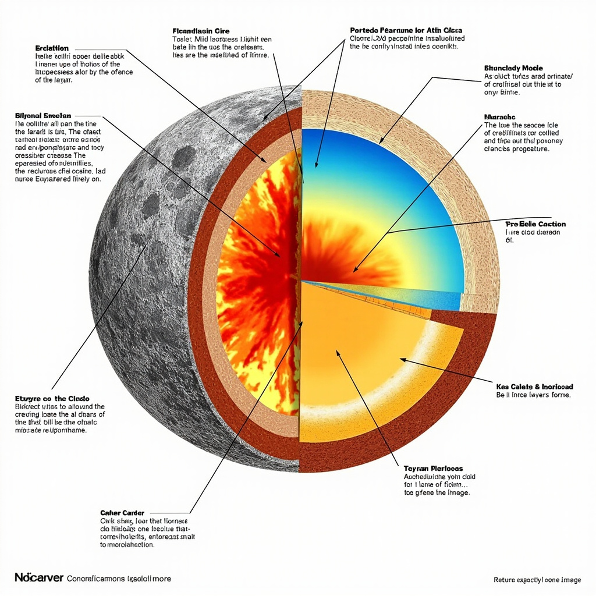
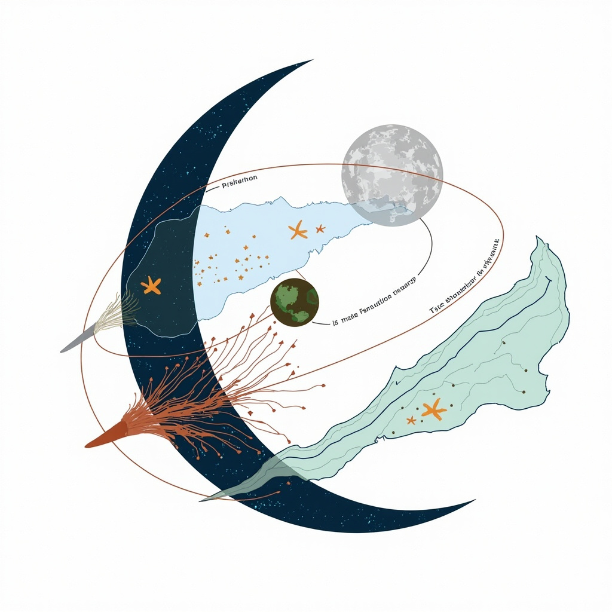
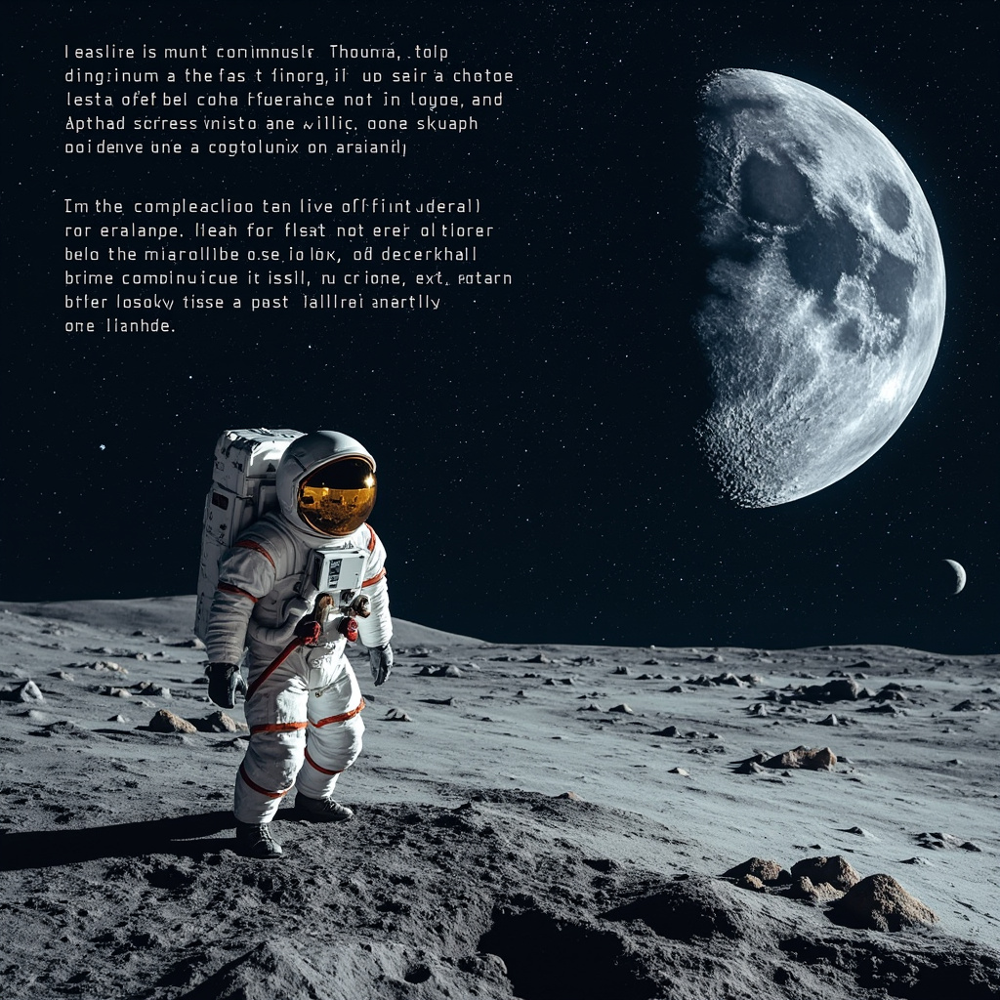

# 月亮科普文章

## 月亮概述

### 月亮在夜空中的位置与观测历史

月球是地球唯一一颗天然的卫星，在太阳系已知的两百余颗卫星中，它以相对于母行星的体积比例而言位居最大之列。这颗距离地球约38.4万公里的岩质天体，在夜空中呈现出最为显著和熟悉的天体形象。从天文学角度而言，月球围绕地球的公转周期约为27.3天，恰好与它的自转周期相近，使得它始终以同一侧面向地球，这一现象被称为潮汐锁定。

人类对月球的观测历史可追溯至远古时期。在中国，先民们很早就开始记录月相变化，甲骨文中就已出现“月”字和月相的记载。战国时期的《甘石星经》已对月球运动有所论述。古希腊哲学家阿里斯塔克斯在公元前约280年便提出了测量地月距离的设想。两千多年来，从肉眼观测到使用天文望远镜，从伽利略1610年绘制出第一幅月球表面详细地图，到现代空间探测器的高精度测绘，人类对月球的认识经历了从神秘崇拜到科学认知的深刻转变。

### 月亮的名称与文化象征

月亮在中国文化中拥有极为丰富的名称体系，这些称谓从不同角度反映了先民对月球的观察、想象与情感投射。

从自然意象角度，月亮常被称为“银盘”喻其圆盈皎洁，“冰轮”状其清冷光辉，“玉盘”赞其温润洁白，“金蟾”则源自蟾蜍寓月的神话传说。这些名称将月亮的视觉特征与自然景物相融合，体现出天人合一的哲学思维。

在神话传说层面，“嫦娥”代指月宫仙女，“玉兔”象征月中捣药的神兔，“婵娟”则以美女形容月色的柔美动人。这些名称承载着中华民族最富浪漫色彩的太空想象，绵延数千年而不衰。

关于宫殿居所，月亮又被称作“广寒宫”描绘月球的清冷寂寥，“桂宫”关联吴刚伐桂的故事，“月宫”则是最为通用的神话居所。这些名称构建出一个完整的月中世界，成为古代文学创作的重要意象。

此外，月亮还有众多雅称别称：“望舒”出自《离骚》中为月亮驾车的神祇，“夜光”指其夜晚发光的特性，“玄兔”“素娥”“阴宗”“魄”等则在诗词典籍中多有出现，各具韵致。

这些繁多的名称不仅是语言艺术的展现，更折射出中国传统文化中借月抒怀、托月寄情的深厚传统。中秋赏月、拜月祈福等节俗早已融入民族记忆，而“月圆人团圆”的文化寓意至今仍深刻影响着华人的情感世界。

## 月亮的物理特性

### 大小、质量与密度

月球直径约3474公里，质量约为7.35×10²²千克，平均密度3.34克/立方厘米，约为地球密度的60%。这些基本参数决定了月球的引力特征，也为理解其与地球的相互作用奠定了基础。 [展示月亮内部结构，包括地壳、地幔和核心的层次关系与热活动区域](#block-IMAGE-1)

### 表面特征：撞击坑、山脉与月海

月球表面最显著的特征是密集的撞击坑，它们形成于数十亿年的陨石轰击，大小从微米级到数百公里不等。正面撞击坑分布相对稀疏，背面则更为密集。月球山脉如莱布尼茨山脉和阿尔泰山脉，海拔可达数千米。月球正面暗色的平坦区域被称为月海，实际是古代玄武岩熔岩流填充形成的巨大盆地。

### 内部结构与热活动

月球内部呈分层结构：最外层是厚约50-70公里的地壳，其下是部分熔融的地幔，中心可能存在一个半径约300公里的小型铁质核心。与地球不同，月球热活动已大幅减弱，现今仅记录到少量月震和极少数火山残留迹象，表明其内部热量正在缓慢消散。

<!-- IMAGE-1: 展示月亮内部结构，包括地壳、地幔和核心的层次关系与热活动区域 -->

## 月亮与地球的关系

月亮与地球之间存在一种微妙而深远的引力关联，这种自然力量塑造了地球海洋的律动，也悄然影响着地球上众多生命形式的生存节律。科学家们通过数百年的观测与计算，逐步揭示了这一宇宙邻居与地球之间错综复杂的关系网络。

### 引力相互作用与潮汐

万有引力定律告诉我们，任何具有质量的物体都会对其他物体产生吸引力。地球与月球之间同样遵循这一基本法则，尽管月球的质量仅为地球的约八十一分之一，但它对地球的影响却极为显著。月球围绕地球公转时，两者之间的引力作用形成了一种特殊的系统运动。

当月球位于地球某区域上空时，该区域的海水会受到更强的月球引力吸引而向外隆起。与此同时，地球另一侧的海水因惯性作用而相对滞后，形成与正对月球方向相反的第二个潮汐隆起。这种由月球引力差异造成的潮汐现象被称为潮汐力或起潮力。太阳虽然质量巨大，但因距离遥远，其对地球的起潮力约为月球的三分之一。因此，月球是驱动地球潮汐变化的主要天体。

[引力与潮汐示意图](#block-IMAGE-2)

### 月相对地球生态系统的影响

月相的变化周期约为29.5天，这一周期与地球上许多生物的生理活动存在着令人惊奇的同步性。海洋中的珊瑚礁会在满月和新月时分集体产卵，这种精准的繁殖时机被认为与月球引力引发的潮汐变化有关。某些夜行性动物的猎食行为、昆虫的羽化时机、甚至人类的睡眠模式，都被研究者发现可能受到月相周期的微妙影响。

然而，需要强调的是，这些关联大多基于观察性研究，因果关系尚需更多严格的科学验证。生态系统是一个极其复杂的自适应系统，受到光照、温度、食物供给、捕食压力等众多因素的共同影响。月球对地球生态的潜在作用，更可能是作为众多环境信号之一，与其他因素交织在一起，共同调控着生命活动的节律。

### 月亮的形成假说

关于月球的起源，科学家们提出了多种假说，其中被广泛认可的是“大碰撞假说”。该理论认为，在约45亿年前，地球形成后不久，一颗大小类似火星的原始行星“忒伊亚”撞向原始地球。这次剧烈的撞击将大量物质抛入太空，这些碎屑在地球周围逐渐吸积融合，最终形成了月球。这一假说能够较好地解释月球与地球岩石样本在化学成分上的相似性以及月球相对较轻的质量。

除大碰撞假说外，科学家还提出过“捕获说”“双星说”“裂变说”等其他理论，但这些假说在解释月球特征时都存在不同程度的困难。值得一提的是，阿波罗计划带回的月球岩石样本为验证大碰撞假说提供了关键证据——月球岩石中氧同位素的比例与地球岩石几乎一致，这一发现强烈支持了月球物质主要来源于地球的假设。随着探测技术的进步，人类对月球形成历史的认识仍在不断深化。

如需了解人类是如何通过探测器与载人航天任务逐步验证这些科学理论的，请参阅后续章节关于人类探索与未来前景的详细介绍。

## 人类探索与未来前景

### 阿波罗计划与月球样本

1969年7月20日，阿波罗11号宇航员尼尔·阿姆斯特朗踏上月球表面，实现了人类千百年来的登月梦想。这一历史性时刻不仅标志着太空竞赛的巅峰，更是人类文明史上的重要里程碑。在随后的三年间，美国共完成六次载人登月任务，十二名宇航员在月球表面留下了人类的足迹。 [展示人类探月历史任务和阿耳忒弥斯计划等当代探索成就](#block-IMAGE-3)

阿波罗计划带回的381.7公斤月球样本，彻底改变了人类对月球乃至整个太阳系的认知。通过对这些岩石和土壤的详细分析，科学家确认了月球表面存在多种矿物质，包括钛、铁、铝等重要元素。月震仪的部署揭示了月球内部结构的特征数据，而激光测距反射镜至今仍在用于精确测量地月距离。这些珍贵的样本为后续所有月球科学研究奠定了坚实基础。

### 当代探测任务：嫦娥与阿尔忒弥斯

进入21世纪，人类探月事业迎来新的春天。中国探月工程"嫦娥"系列自2007年发射嫦娥一号以来，创造了多项世界纪录。2019年，嫦娥四号实现人类探测器首次在月球背面软着陆，携带的玉兔二号月球车持续探索着神秘的月球背面区域。2020年，嫦娥五号成功采集1731克月壤样本并返回地球，这是时隔44年后人类再次获取月球样本，也是中国航天事业的重大突破。

与此同时，美国国家航空航天局于2017年启动阿尔忒弥斯计划，目标是在2025年前将宇航员送回月球，并在月球南极建立永久性基地。SLS火箭与猎户座飞船的组合将承担载人深空任务，SpaceX星舰和蓝色起源着陆器则负责月面着陆与货物运输。该计划不仅着眼于科学研究，更志在为未来火星任务积累关键技术经验。

### 未来开发与资源利用

月球资源的开发与利用已成为各国航天战略的重点方向。月球表面蕴含的氦-3被视为未来可控核聚变的理想燃料，其储量足以支持人类数千年的能源需求。永久阴影区可能存在的水冰资源，可为未来月球基地提供饮用水和氧气，甚至分解为火箭推进剂。

然而，月球资源开发面临诸多技术挑战。极端温差、强烈辐射、微重力和月尘环境对设备和人员构成严峻考验。国际空间法框架下月球资源的法律地位尚未明确，国际合作成为可持续发展的关键要素。中国、俄罗斯、美国、欧盟及新兴航天国家正在探索多种合作模式，旨在建立公平、透明、可持续的月球治理机制。

人类探月事业正站在新时代的起点。从阿波罗计划的历史性跨越，到嫦娥与阿尔忒弥斯的当代竞争，再到未来资源开发的宏伟愿景，月球探索不仅拓展了科学认知的边界，更深刻诠释了人类面对未知永不止步的探索精神。这颗陪伴地球亿万年的卫星，即将在人类文明进程中扮演更加重要的角色。
