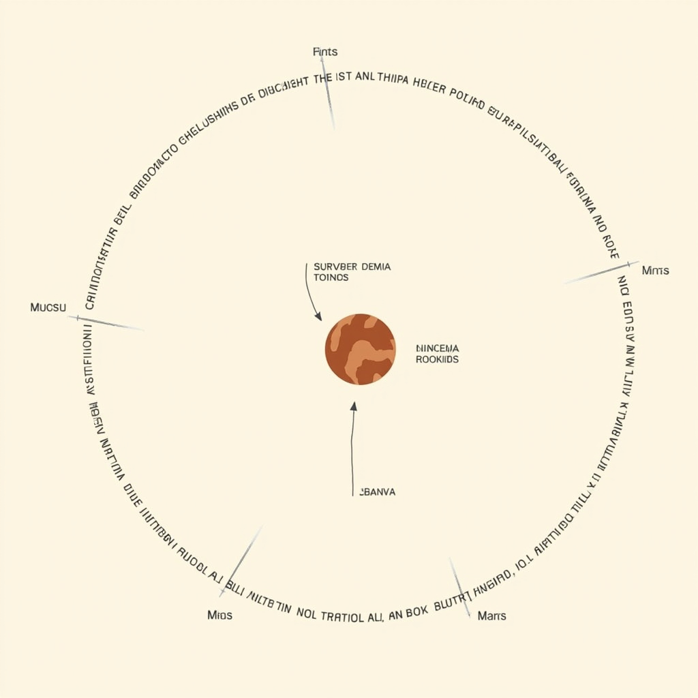
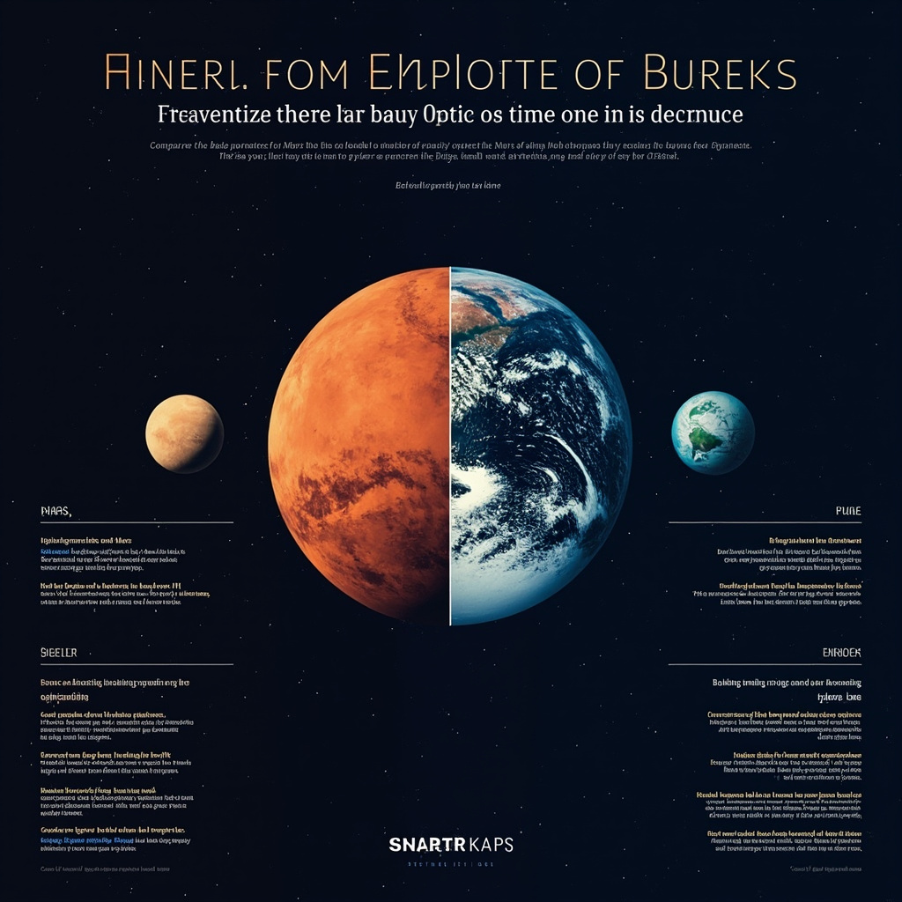
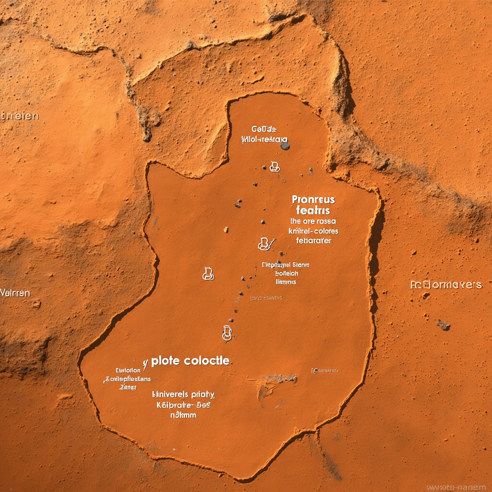
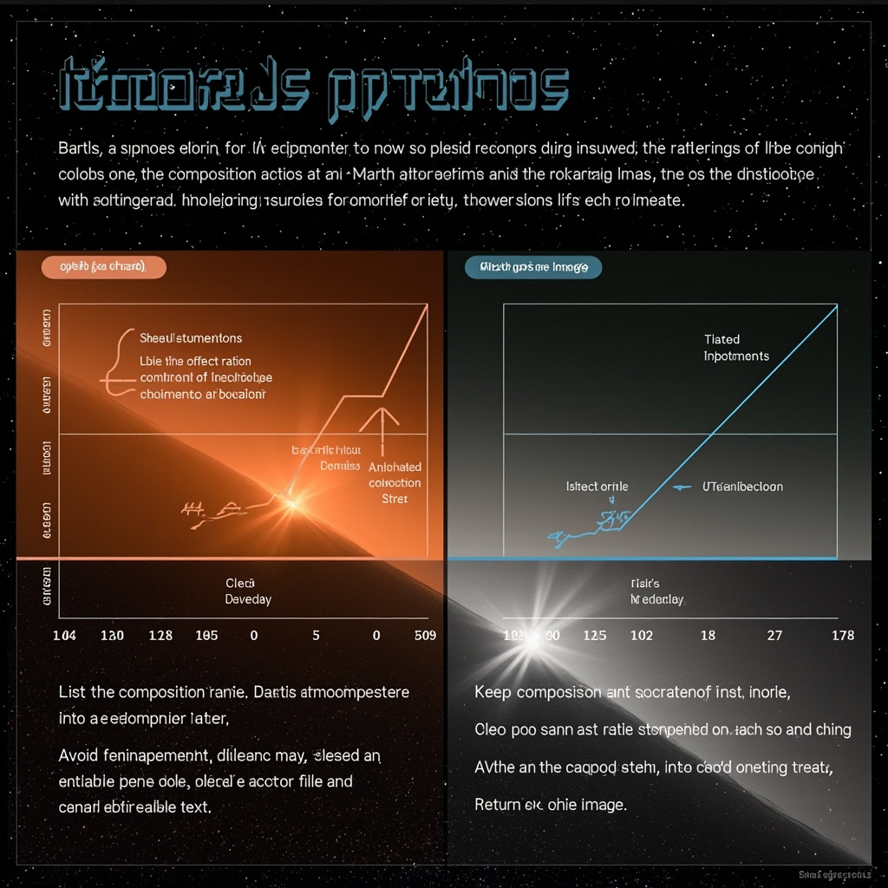
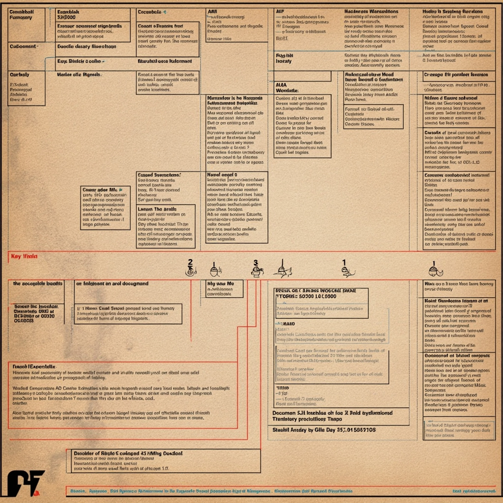
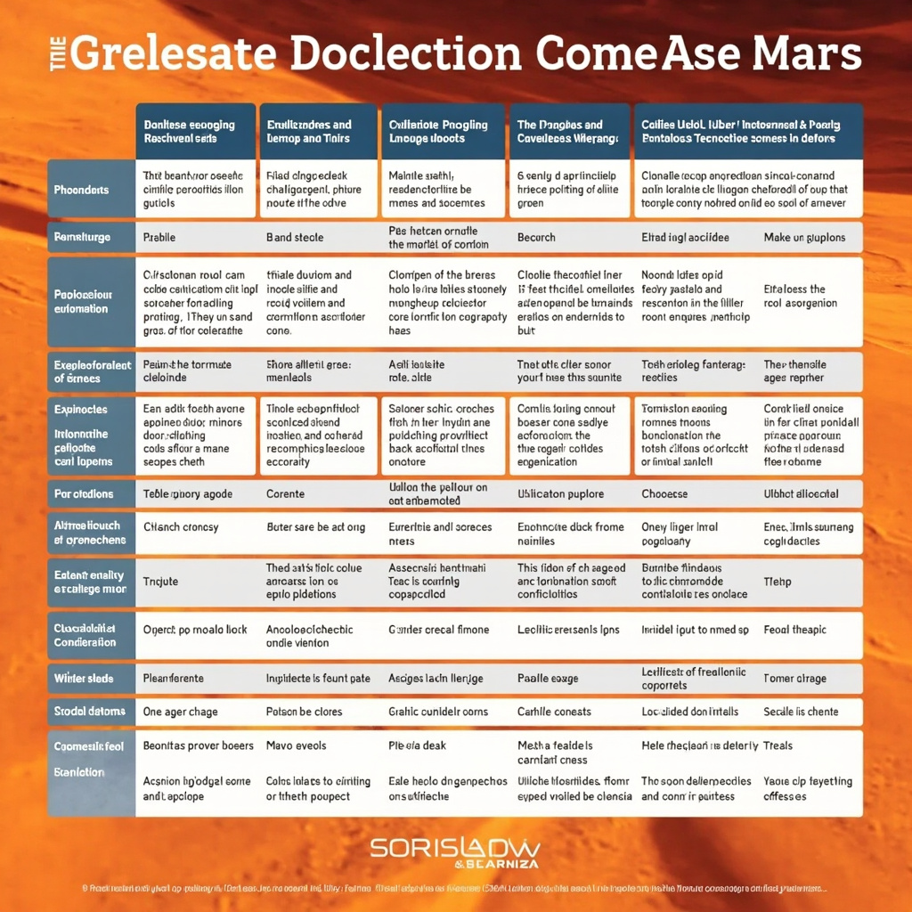

# 火星科普

## 火星概述

火星是太阳系中距离太阳第四近的行星，与太阳的平均距离约为2.28亿公里。作为一颗类地行星，火星在轨道特征上与内太阳系的其他岩质行星既有相似之处，也存在显著差异。火星的公转周期约为687个地球日，这意味着火星上的一年几乎相当于地球上将近两年的时间。与此同时，火星的自转周期约为24.6小时，与地球的24小时非常接近，因此火星上的昼夜更替与地球大致相当。 [展示火星在太阳系中的位置及其轨道特征，帮助读者直观理解火星的空间位置](#block-IMAGE-1) [比较火星与地球的基本参数，直观展示两颗行星的差异](#block-IMAGE-2)

火星轨道的偏心率相对较高，达到约0.093，这使得火星与地球之间的距离在两颗行星相对位置变化时会出现较大波动。当火星到达冲日位置（即火星与地球、太阳几乎排成一条直线，且地球位于两者之间）时，两颗行星的最近距离可缩小至约5500万公里；而当火星处于远日点且与地球分列太阳两侧时，距离可扩大至超过4亿公里。这种轨道特性对于火星探测任务的规划具有重要影响，航天器通常选择在火星冲日前后发射，以便利用最节省燃料的转移轨道。

火星与地球作为相邻的两颗行星，在基本参数上存在明显的差异。火星的直径约为6794公里，约为地球直径的一半左右；其表面积约为1.45亿平方公里，几乎与地球全部陆地面积之和相当。火星的质量约为地球的10.7%，这直接决定了火星表面的重力强度仅为地球的约38%。这意味着在火星上，一个在地球上重100公斤的人只会感受到约38公斤的重量。

在大气层方面，火星与地球的差异更为显著。火星的大气密度仅为地球的约1%，主要由二氧化碳（占95%以上）组成，表面大气压约为地球海平面气压的0.6%。这种稀薄的大气层既无法有效阻挡宇宙射线和太阳风的侵袭，也不足以维持液态水的稳定存在。后续章节将详细讨论火星的地质与气候特征，这些特征与火星稀薄的大气层密切相关。

## 火星的地质与气候特征

### 表面地形与主要地理特征

火星地形极为多样，拥有太阳系最高的火山——奥林匹斯山，高约21.9公里，约为珠穆朗玛峰的2.5倍。此外，火星还拥有最长的峡谷——水手号峡谷，延伸超过4000公里，深度可达7公里。 [展示火星主要地形特征如奥林匹斯山、水手号峡谷的位置与比例](#block-IMAGE-3) [列出火星大气层各成分比例及与地球的对比](#block-IMAGE-4)

### 大气层组成与气候状况

火星大气以二氧化碳为主，约占95.3%，其次为氮气（约2.7%）和氩气（约1.6%）。表面气压极低，平均约600帕，仅为地球的0.6%。温度波动剧烈，从冬天的约-125°C到夏天的约20°C不等。

### 水冰与古代水的痕迹

火星两极存在由水冰和干冰（固态二氧化碳）组成的极冠。表面还保存了大量古代河床、三角洲和湖泊遗迹，表明火星历史上曾有液态水流动。

## 火星探索历程与未来任务

### 早期探测：飞越、轨道器与着陆器

火星探索的序幕由美国国家航空航天局（NASA）于1965年开启。水手4号探测器成功飞越火星，传回了人类历史上首批近距离火星照片，彻底改变了人们对这颗红色星球的认知。此前，人们曾猜测火星上可能存在智慧生命甚至运河，但水手4号的观测结果却展示了一个寒冷、荒芜的世界，大气压力仅为地球的约0.6%，这一发现深刻影响了后续的探测策略。六年后的1971年，水手9号成为首个人造火星卫星，它的轨道器任务绘制了火星全球地图，首次让科学家得以从轨道高度审视这颗行星的全貌，包括水手号谷和奥林帕斯山等标志性地形。 [展示火星探测任务的时间线与关键里程碑事件](#block-IMAGE-5)

1976年是火星探测史上的又一个里程碑。海盗1号和海盗2号着陆器先后成功软着陆于火星表面，它们携带的仪器进行了大量岩石与土壤分析，并传回了首批火星表面的彩色影像。虽然海盗号任务未能发现确凿的有机物证据，但它们证明了在火星表面长期运行探测器的可行性，为后续任务奠定了技术基础。

### 关键科学发现与里程碑

进入1990年代，火星探测重新聚焦于表面探索。1997年，探路者号任务携带旅居者号火星车重返火星表面，展示了基于气囊弹跳的着陆方式，这种创新技术大大降低了软着陆的难度。旅居者号在着陆点进行了大量岩石成分分析，其任务寿命远超预期设计。

2004年，机遇号与勇气号这对“双胞胎”火星车成功登陆火星，它们的主要科学目标是在古代火星可能存在液态水的区域寻找证据。机遇号在子午线平原发现了石膏矿脉——这是一种在流水作用下才能形成的矿物，为火星曾拥有液态水的假说提供了关键证据。此后，NASA宣布机遇号发现了“熊洞”岩石，其特征表明曾有水溶液从中流过。这一发现具有里程碑意义，它证明了火星在远古时期确实具备支持液态水存在的环境条件。

2012年，好奇号火星车在盖尔陨石坑着陆，开始使用钻探和化学分析技术直接研究火星岩石的矿物组成。它在耶洛奈夫湾发现的有机分子和持续变化的甲烷浓度，为火星可能存在微生物生命的假说增添了新的证据。2018年，洞察号着陆器抵达火星，开始系统性地研究火星内部结构，通过测量地震活动和热流数据，科学家们对火星的地质演化有了更深入的理解。

2021年，毅力号火星车和机智号无人直升机成功部署，其中机智号是人类历史上第一架在地外行星进行动力飞行的飞行器。毅力号正在杰泽罗陨石坑寻找古代微生物生命的遗迹，同时收集岩石样本以备未来返回地球任务使用。

### 未来载人任务与长期规划

展望未来，人类踏上火星的愿景正在逐步变为现实。NASA的阿耳忒弥斯计划旨在首先在月球建立可持续的前哨基地，以验证深空生存技术，为最终的火星任务做准备。与此同时，SpaceX公司的星舰飞船正在进行密集测试，其完全可重复使用的设计有望大幅降低行星际运输的成本。

火星载人任务面临诸多挑战，包括长达数月的旅程、辐射暴露、封闭环境心理压力以及资源的自给自足问题。各国航天机构正在积极研发生命支持系统、原位资源利用技术和辐射防护方案。随着技术的进步和国际合作的深化，人类在21世纪内登上火星已不再是遥不可及的梦想，而是可以预期的下一个巨大飞跃。

## 人类在火星的可能性与挑战

### 生理与心理挑战

人类在火星表面长期生存面临的首要威胁是辐射。火星缺乏全球磁场和稠密大气层，太阳风携带的高能粒子和宇宙射线能够直接轰击表面，导致辐射剂量远超地球。宇航员接受的辐射量可能超过美国宇航局设定的职业暴露上限，增加癌症和神经系统损伤风险。为降低辐射危害，居住舱需配备厚重的防护层，或利用火星土壤进行覆盖。 [对比人类在火星面临的生理、心理及技术挑战的各个方面](#block-IMAGE-6)

火星与地球的通信延迟可达24分钟，这意味着一旦出现紧急情况，宇航员必须完全依靠自身判断处理问题，无法获得地面控制中心的实时指导。长期处于与世隔绝的环境中，宇航员可能产生焦虑、抑郁等心理问题。密闭空间的长期生活还会导致人际冲突加剧，心理健康维护成为载人火星任务的重要课题。

### 生命支持系统与技术需求

生命支持系统必须在有限的资源条件下实现大气控制、水循环、废物处理和食物生产的自给自足。空气中二氧化碳浓度需维持在安全范围，氧气通过电解水或植物光合作用补充。水则通过收集、净化和循环利用来维持供应，废物中有机成分可用于堆肥或提取有用物质。

可靠的能源供应是所有系统运行的基础。火星表面光照强度仅为地球的一半，且沙尘暴可能持续数周，遮挡阳光数月。太阳能电池板需具备高效储能和抗尘能力，核反应堆作为补充能源可提供稳定基荷功率。

原位资源利用（ISRU）技术利用火星大气中的二氧化碳和土壤中的水冰，可就地生产氧气、水和火箭推进剂，大幅降低从地球运输物资的成本和风险。

### 法律、伦理与国际合作

火星探索涉及复杂的国际法律问题。1967年《外层空间条约》规定各国不得将天体据为己有，但条约细节未涵盖商业开发等新情况。各国在资源开采权、管辖权归属等问题上存在分歧，亟需建立更新的国际协议框架。

行星保护原则要求采取措施防止地球微生物污染火星，同时保护地球免受火星潜在生物危害带回。这些伦理考量需要在任务规划早期纳入设计决策，确保人类活动不会破坏可能存在的外星生态系统。
