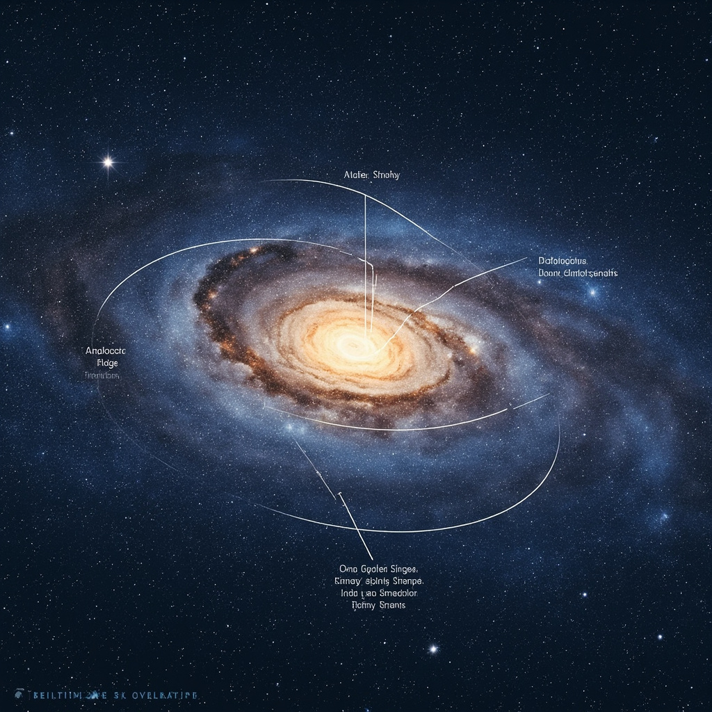
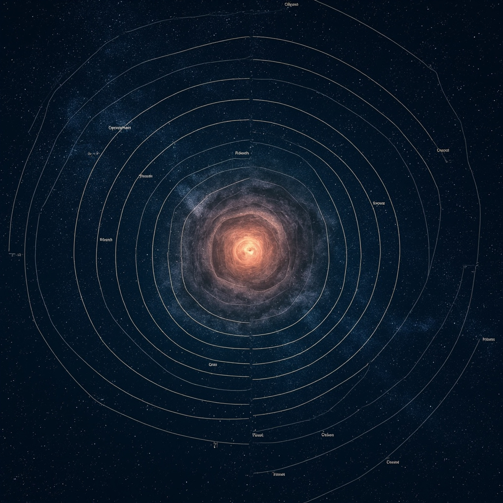

# 银河系：我们的星际家园

## 银河系概述

### 定义与基本概念

银河系是一个包含太阳系在内的棒旋星系，直径约10万光年，蕴含数千亿颗恒星。

### 银河系在宇宙中的位置

银河系并非孤立存在，而是位于一个称为本星系群的星系集合中。本星系群包含约50个星系，银河系与仙女座星系是其中最大的两个成员，它们如同引力舞台上的主角，相互环绕运动。

在更大的宇宙结构中，本星系群隶属于拉尼亚凯亚超新星团——一个包含约10万个星系的巨大结构。这种层级的宇宙组织揭示了银河系在可观测宇宙中的具体位置：从太阳到银河系边缘，再到本星系群，最终融入局部宇宙网络。

银河系与邻近星系的互动同样引人关注。科学家预测，银河系与仙女座星系将在约40亿年后发生碰撞合并，形成一个更大的椭圆星系。这一宏大的宇宙事件提醒我们，银河系并非静态永恒的家园，而是在持续演化之中。了解银河系在宇宙结构中的位置，不仅有助于认识我们所栖息的星系本身，更是理解整个宇宙运行规律的重要起点。

## 银河系结构

银河系中心隐藏着一个超大质量黑洞——人马座A\*，其质量约为太阳的400万倍。银心周围是密集的核球结构，这是一个由数十亿颗古老恒星组成的椭球形区域，恒星的密度随靠近银心而急剧增加。 [展示银河系的整体结构，包括银心、核球、银盘、旋臂和银晕等主要组成部分的位置关系，帮助读者建立银河系空间结构的直观认知。](#block-IMAGE-1)

银河系呈典型的盘状结构，拥有4条主要旋臂，分别是英仙臂、人马臂、矩尺臂和盾牌-半人马臂。太阳系位于较小的猎户臂内侧。旋臂是活跃的恒星形成区，那里气体和尘埃密度较高，不断孕育着新的恒星。

银晕是包围银河系的球形稀疏区域，主要由老年恒星和球状星团组成。更为关键的是，暗物质在银晕中大量分布，科学家估算暗物质约占银河系总质量的85%。虽然暗物质不可见，但通过其引力效应——包括对银河系旋转曲线的观测——科学家能够推断出它的存在和分布。这些看不见的物质如同无形的骨架，支撑着整个银河系的结构，使其在高速旋转中不至于分崩离析。

## 银河系中的恒星

银河系是一个拥有惊人恒星数量的巨大星系。科学家估计，我们的银河系中大约包含1000亿至4000亿颗恒星，这个数字远远超出了普通人日常经验的理解范围。为了帮助读者感受这一尺度，可以做一个形象的类比：如果把地球上所有的海滩沙子都收集起来，其中的颗粒总数大约也就在千亿级别——与银河系中的恒星数量相当。银河系中的恒星并非均匀散布在整个宇宙空间中，而是遵循着特定的分布规律。它们绝大多数集中在银盘这一扁平结构中，尤其是沿着银盘上延伸的旋臂分布。这是因为旋臂是恒星诞生的活跃区域，那里的气体和尘埃密度更高，为新恒星的形成提供了充足的原材料。 [展示太阳系在银河系旋臂中的相对位置，帮助读者理解人类在银河系中的空间位置及其与银河系整体结构的关系。](#block-IMAGE-2)

恒星的世界是多样的。按照光谱特征，科学家将恒星划分为O、B、A、F、G、K、M等类型，这一分类体系被称为摩根-肯纳（Morgan-Keenan）分类法，从最炽热、最明亮的蓝色O型星，一直到温度较低、呈红色的M型红矮星。我们的太阳是一颗G型恒星，表面温度约为5500摄氏度，正处于恒星生命周期的壮年阶段。恒星的演化是一个漫长而复杂的过程，它们从分子云中的原恒星开始，在引力作用下逐渐收缩并点燃核聚变，进入主序星阶段；随着核心氢燃料的耗尽，恒星会膨胀成为红巨星，体积急剧增大；最终，根据初始质量的不同，恒星会以白矮星、中子星或黑洞等形式结束其光辉历程。我们的太阳目前正处于主序星阶段，已经稳定燃烧了约46亿年，预计还有约50亿年才会走向生命的终点。

在浩瀚的银河系中，我们的太阳系位于一个相对安静却并非偏僻的角落。太阳坐落于银河系的猎户臂（Orion Arm）内侧边缘，这里是一条较小的旋臂，介于人马臂和英仙臂之间。太阳到银河系中心的距离大约为26000光年——这个距离意味着，即使以光速旅行，从太阳出发也需要26000年才能抵达银心。按银河系的整体尺度来看，太阳处于银盘的中距环带上，既不靠近拥挤的核心区域，也不处于偏远的边缘地带。正是这种“中等”的位置，使得我们的太阳系既能避开银心附近高强度的辐射和引力扰动，又能获得足够的物质资源形成行星系统，为生命的诞生提供了恰到好处的条件。

## 银河系的探索历程

### 早期观测发现

古代文明已经注意到夜空中那条朦胧的光带，将其视为天上的河流或牛奶之路。1610年，伽利略将自制的望远镜指向银河，发现这条光带实际上由无数密集的恒星组成，首次揭示了银河的真正本质。

### 现代研究方法

18世纪后期，威廉·赫歇尔通过恒星计数方法推断太阳位于银河系附近而非中心。20世纪初，哈勃利用造父变星的周光关系证实了仙女座星云是独立的星系，改变了人类对宇宙结构的认知。

20世纪中叶以来，射电望远镜能够穿透星际尘埃揭示银河系的旋臂结构；红外观测技术则让科学家得以窥探被尘埃遮蔽的银心区域。阿伦辐射带望远镜、斯皮策空间望远镜等设备极大丰富了对银河系组成成分的了解。

2013年发射的欧空局盖亚卫星持续测绘数十亿颗恒星的位置和运动，提供了迄今为止最精确的银河系三维结构图谱。这些观测数据正在帮助天文学家重建银河系过去100亿年的演化历史。

## 银河系的未来与意义

### 银河系的演化前景

银河系并非永恒不变，它正处于动态的演化进程之中。大约在45亿年后，银河系将与邻近的仙女座星系发生壮观的碰撞与合并，两个巨型旋涡星系将逐渐交织成一个更加庞大的椭圆星系。届时，恒星之间的距离虽然遥远，但这场宇宙级的事件仍将重塑银河系的整体结构。与此同时，恒星演化持续进行，老年恒星不断抛洒外层物质，而新的恒星则在星际云中诞生，宇宙的生生不息在此刻得到完美诠释。

### 人类探索宇宙的意义

人类探索银河系与广袤宇宙，其意义远超科学本身。从科技发展的角度而言，航天事业、材料科学、信息技术等领域的突破性进展，很大程度上得益于对宇宙的不懈探索，这些技术最终回馈日常生活，惠及每一位普通人。然而，更深层的意义在于人类对未知的本能追求——好奇心驱使着我们望向星空，追问自身在宇宙中的位置与命运。正是这种求知精神，推动着人类文明不断前行。认识到我们在宇宙中的渺小与珍贵，反而让我们更加珍视脚下这颗蓝色星球——目前已知唯一孕育生命的家园。保护地球、珍惜当下，成为探索宇宙给予人类最深刻的启示。