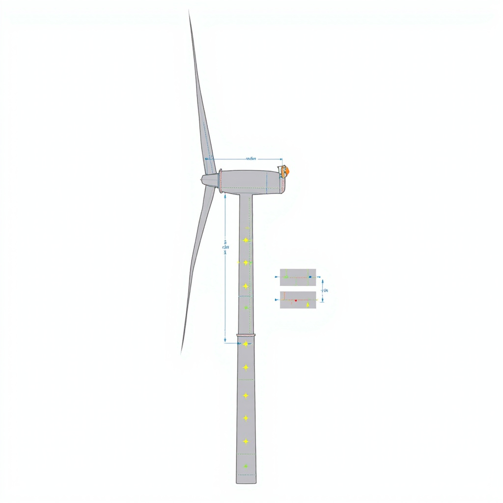
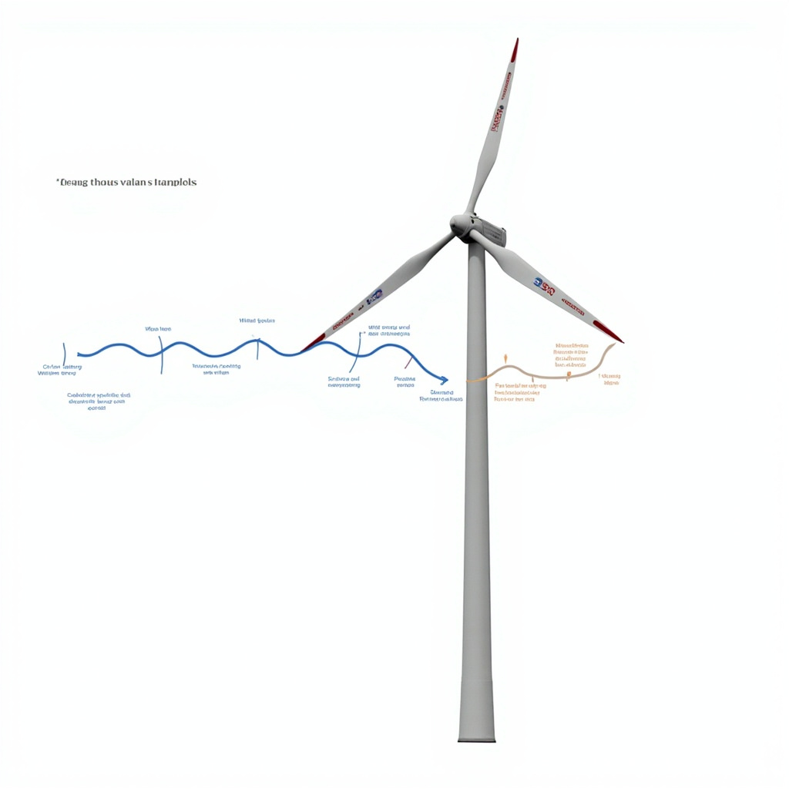
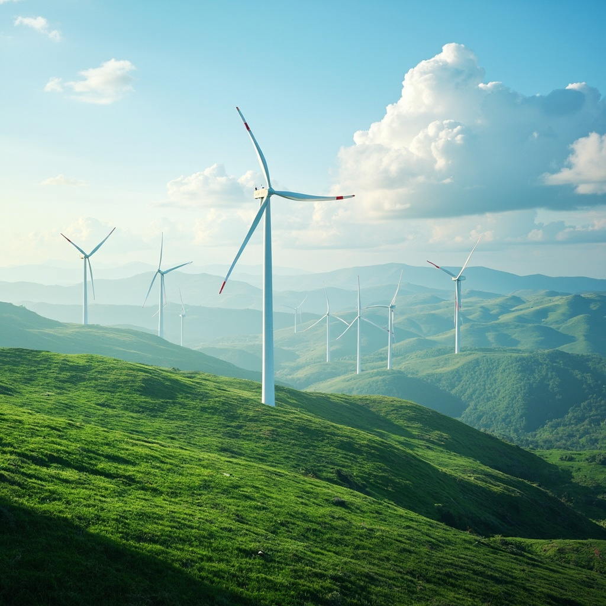

# 风力发电技术讲解

风能是地球表面因太阳辐射导致空气流动而形成的一种自然能源，作为一种取之不尽、用之不竭的可再生清洁能源，风能在全球能源结构转型中发挥着越来越重要的作用。风能资源的分布受地理位置、地形条件和气候特征的影响而呈现出显著的差异，一般而言，海岸线、开阔平原和高山峡谷等地区的风能资源更为丰富。从事风力发电技术研究的核心在于理解如何将这种无形的流动能量高效地转化为可供人类使用的电能。

风力发电的基本原理建立在空气动力学的基础之上，其核心部件是风轮，风轮由若干叶片组成，当风吹过叶片表面时，由于叶片的特殊翼型设计，使得叶片两侧形成气压差，从而产生推动叶片旋转的升力，正是这种升力驱动风轮持续转动，实现了对风能的捕获。风轮捕获风能的能力与风速的立方成正比，这意味着风速的微小提升就能带来发电量的显著增加，因此风力发电的效率高度依赖于风能资源的品质。现代风力发电机主要采用水平轴三叶片设计，叶片多由碳纤维和玻璃纤维复合材料制成，既保证了轻质高强度的特性，又能在强风、暴雨、盐雾等恶劣环境下长期稳定运行。风轮的转速通过齿轮箱进行增速后传递给发电机，发电机将机械能转化为电能，再经过变流器和变压器处理后并入电网。为了最大化利用风能，现代风机还配备了智能控制系统，能够根据风速、风向的变化自动调整叶片的桨距角和机舱朝向，确保在各种工况下都能保持最佳的发电效率。

水平轴风力发电机是目前应用最为广泛的机型，其主要系统组成包括塔架、风轮、主轴、齿轮箱、发电机以及控制系统等关键部件。塔架支撑整个机组并提供必要的离地高度，因为高处风速更稳定、能量密度更高；风轮负责捕获风能并将其转化为旋转的机械能；齿轮箱则将风轮的低转速提升到发电机所需的高转速；发电机是实现能量转换的核心设备，将机械能最终转化为电能。

风能转换为电能的过程是一个多环节的能量传递链条。当风轮在风力作用下旋转时，风轮的动能通过主轴传递到齿轮箱，经过增速后驱动发电机转子转动，发电机内部利用电磁感应原理使定子线圈产生感应电流，从而输出交流电。转换过程中涉及多个能量损失环节，包括风轮的气动损失、传动系统的机械损失以及发电机内部的电磁损失，现代先进风力发电机的整体转换效率通常可达40%至45%左右。控制系统在整个过程中扮演着至关重要的角色，它负责实时监测风速、叶片角度和机组运行状态，通过调节叶片的桨距角来优化捕能效率，并在风速过大或过小时采取保护措施确保机组安全运行。

风力发电技术具有多方面的显著优势。首先，风力发电过程不燃烧任何燃料，在运行阶段不产生任何污染物和温室气体排放，是一种真正清洁环保的能源形式。其次，风能是天然的自然资源，不需要进行开采或运输，能源获取成本相对稳定。此外，风电技术的成熟度不断提高，单位发电成本持续下降，在许多地区已经具备与传统化石能源竞争的经济性。大规模的风电场还可以与农业用地兼容利用，实现土地资源的多重利用价值。

当前全球风电技术正处于快速发展阶段，风力发电装机容量持续增长，技术创新不断涌现。现代风力发电机朝着大型化方向发展，单机容量从早期的数十千瓦提升到如今的数兆瓦甚至十几兆瓦，叶轮直径也相应增大以捕获更多风能。海上风电作为新兴发展方向，凭借海面风速更高、风向更稳定的特点，正在成为各国重点布局的领域。与此同时，智能化控制技术的应用使得风电场的运维效率显著提升，数字化和物联网技术正在重塑风电行业的运营模式。