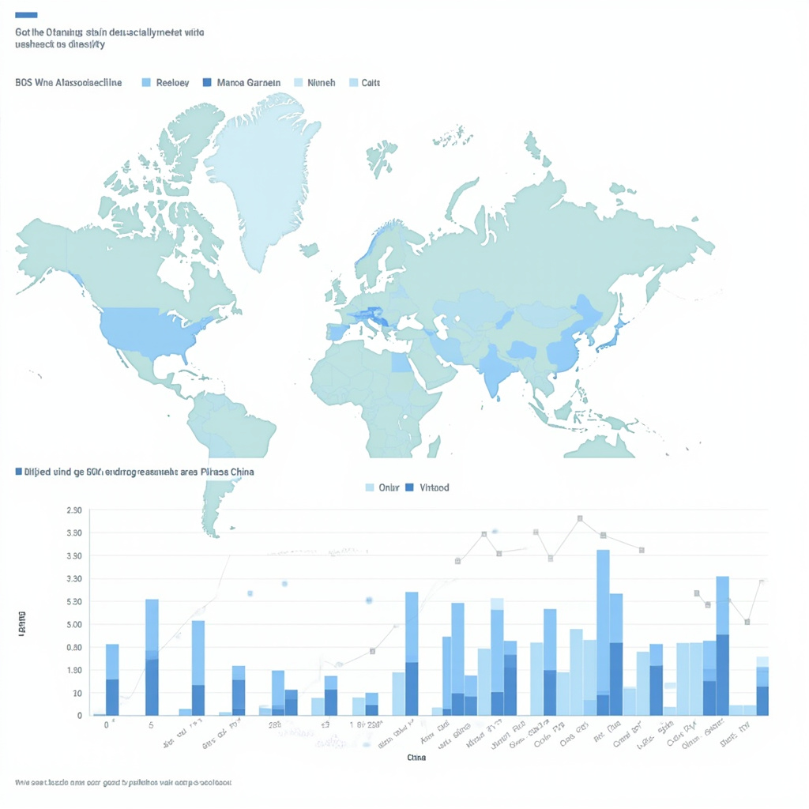
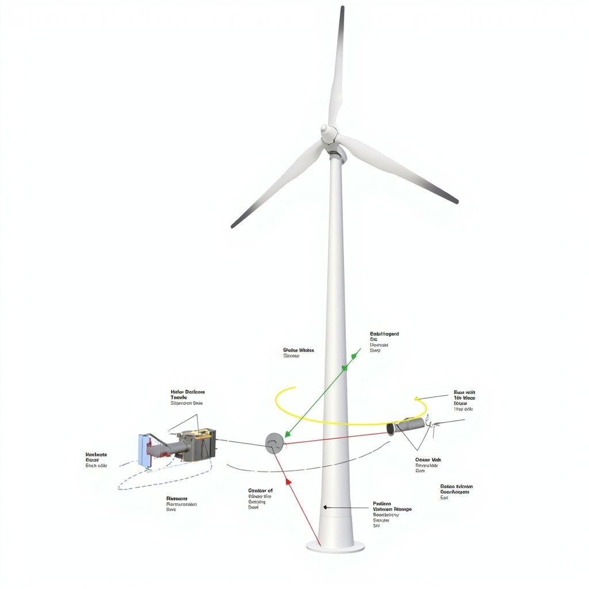
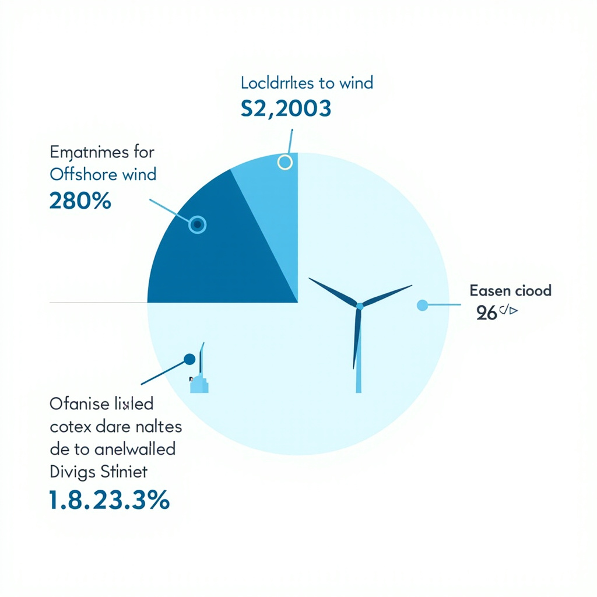

# 风力发电技术讲解

## 风力发电概述

风能是地球大气层中空气流动产生的动能，其形成源于太阳辐射对地球表面不均匀加热引起的大气环流。作为一种清洁、可再生的绿色能源，风能具有资源丰富、分布广泛、环境友好等显著优势，在全球能源转型中发挥着越来越重要的作用。 [展示中国风能资源地理分布特征和全球及中国风电装机容量增长趋势，为读者提供风能资源与利用现状的直观数据支撑](#block-IMAGE-1) [承接本节建立的风能资源基础，引导读者深入了解风力发电的具体技术实现](#block-sec-002)

中国风能资源丰富，主要集中在西北、华北和东北地区。内蒙古、新疆、甘肃、河北、吉林等省份拥有丰富的风能储量，其中内蒙古草原和西北戈壁滩是重点开发区域。近年来，海上风电场在江苏、广东、浙江等沿海地区快速发展，进一步扩大了风能利用规模。

全球风电装机容量持续增长，中国2023年新增风电装机容量约7500万千瓦，累计装机容量已突破4亿千瓦。随着技术进步和规模效应，风电成本不断下降，发电效率显著提升，为风电大规模应用奠定了经济基础。

风电作为实现碳中和目标的重要支撑，在能源结构转型中发挥着关键作用。它不仅是减少碳排放、实现绿色低碳发展的有效途径，更为全球能源系统可持续发展做出了重要贡献。未来，海上风电将成为重要增长极，为沿海地区提供清洁电力。风电技术持续创新，成本逐步降低，在全球能源转型中扮演关键角色，为实现碳中和目标提供重要支撑。

## 风力发电工作原理与系统组成

### 风能转化为电能的基本原理

风力发电的核心原理是将风的动能转化为机械能，再由机械能转化为电能。当风流经风力发电机的叶片时，气流在叶片表面形成压力差，产生推动叶片旋转的升力。这一过程遵循贝兹定理（Betz's Law）的基本原理，该定理指出理想风力机最多只能捕获流经叶片扫掠面积59.3%的风能，实际应用中主流机组的最大转换效率通常在35%至45%之间。叶片捕获的旋转动能通过主轴传递至齿轮箱，齿轮箱将低转速高扭矩的输入转换为高转速低扭矩的输出，最后驱动发电机转子旋转切割磁力线，从而产生感应电动势并输出交流电能。整个能量转化链条为：风能→叶片机械能→齿轮箱调速后的机械能→发电机输出的电能，其中每个环节的效率损失共同决定了机组的最终发电效率。 [展示风力发电系统主要组件（叶片、发电机、齿轮箱、塔筒等）的结构关系和工作流程，帮助读者理解风能转化为电能的系统组成](#block-IMAGE-2) [回顾风能资源的基础信息，承接前一节建立的概念框架](#block-sec-001)

### 风力发电系统的主要组件

风力发电机组由多个核心部件组成，各组件协同工作以实现高效稳定的发电。叶片是捕获风能的关键部件，现代大型风机普遍采用三叶片设计，叶片长度可达数十米至上百米，采用玻璃纤维或碳纤维复合材料制成，需具备优异的空气动力学性能和结构强度。齿轮箱连接主轴与发电机，承担转速匹配和扭矩变换功能，其设计寿命通常要求达到20年以上。发电机是电能转化的核心设备，目前主流机型多采用双馈异步发电机或永磁同步发电机，前者可通过励磁调节实现部分功率的柔性并网，后者在低风速区域具有更高的转换效率。塔筒支撑整个机组并将叶片送至高空以获取更稳定的风能，其高度通常在80米至160米之间，采用钢制锥形筒体结构以兼顾强度与经济性。控制系统作为机组的“大脑”，实时监测风速风向、机组振动、温度等参数，通过变桨系统和偏航系统调整叶片角度和机舱朝向，实现最优功率捕获，同时具备过载保护、故障诊断等功能，确保机组在各种工况下安全运行。现代主流风力发电机组的单机额定功率通常在2兆瓦至15兆瓦之间，海上风电机组正向更大功率方向发展。

## 风力发电的优势与发展前景

### 风力发电的主要优势

风力发电作为清洁能源的代表，其最显著的优势在于零燃料消耗和零碳排放。风能作为可再生能源，在发电过程中不产生二氧化硫、氮氧化物等大气污染物，也不排放温室气体。相较于传统火力发电，每利用1千瓦时风电可减少约0.9千克二氧化碳排放。按当前全国风电装机容量计算，风电每年可减排数亿吨二氧化碳，为应对气候变化做出重要贡献。风电场的运行过程不涉及燃烧反应，对大气和水体均无污染，是真正意义上的清洁能源。 [展示风力发电与其他能源形式的优势对比以及海上风电、低风速区域风电等新兴发展方向的市场前景数据](#block-IMAGE-3)

风力发电的经济优势同样突出。风能作为天然资源无需采购，发电边际成本极低。得益于技术进步和产业规模扩张，风电度电成本持续下降，已在国内多数地区实现与燃煤发电平价甚至更低。风电场的运维成本相对稳定，主要集中在设备维护和少量人员支出。长期来看，风电项目的全生命周期成本优势明显，为投资者带来稳定回报。

### 发展趋势与应用前景

技术进步持续推动风电效率提升和成本下降。新型风机叶片采用碳纤维复合材料，叶轮直径不断增大，捕风能力显著提高。智能控制系统的应用使风机能够根据风向和风速实时调整运行姿态，始终保持最佳发电状态。参考风力发电系统的工作原理（详见[风能转化为电能的基本原理](#block-sec-002)），这些技术创新进一步提升了能量转换效率。

海上风电和低风速区域风电成为行业发展的新兴方向。海上风资源丰富且稳定，海上风电的年发电利用小时数普遍高于陆上风电。随着漂浮式基础技术的成熟，深远海风电开发将成为可能。低风速区域风电通过采用更大扫风面积和更低切入风速的风机，使原本不具备开发价值的区域也能实现经济开发，大幅拓展了风电的开发空间。

展望未来，风电在新型电力系统中将占据更加重要的地位。随着储能技术进步和电网互联互通的完善，风电的间歇性问题将逐步得到解决。预计到2030年，风电将成为继水电之后的第二大电源品种。政策支持力度持续加大，技术创新不断突破，产业规模稳步扩张，风力发电正迎来黄金发展期，为实现碳达峰、碳中和目标提供坚实的清洁能源支撑。