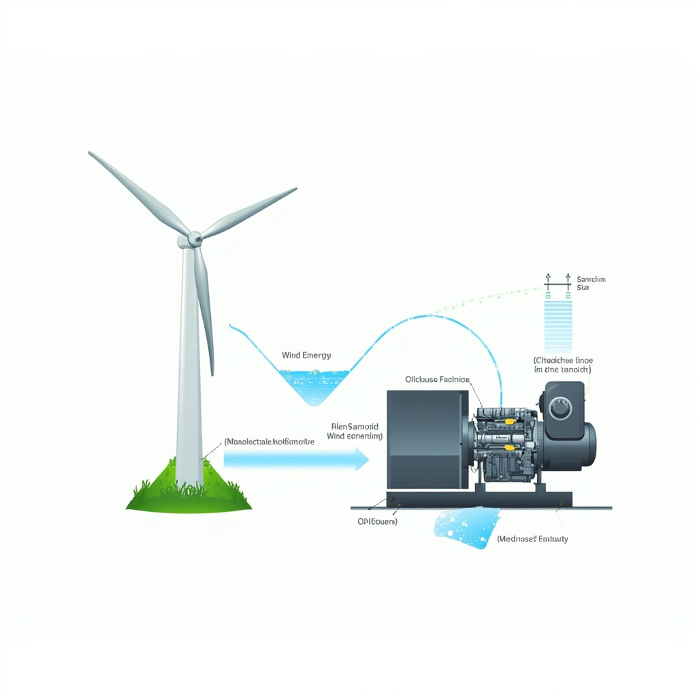
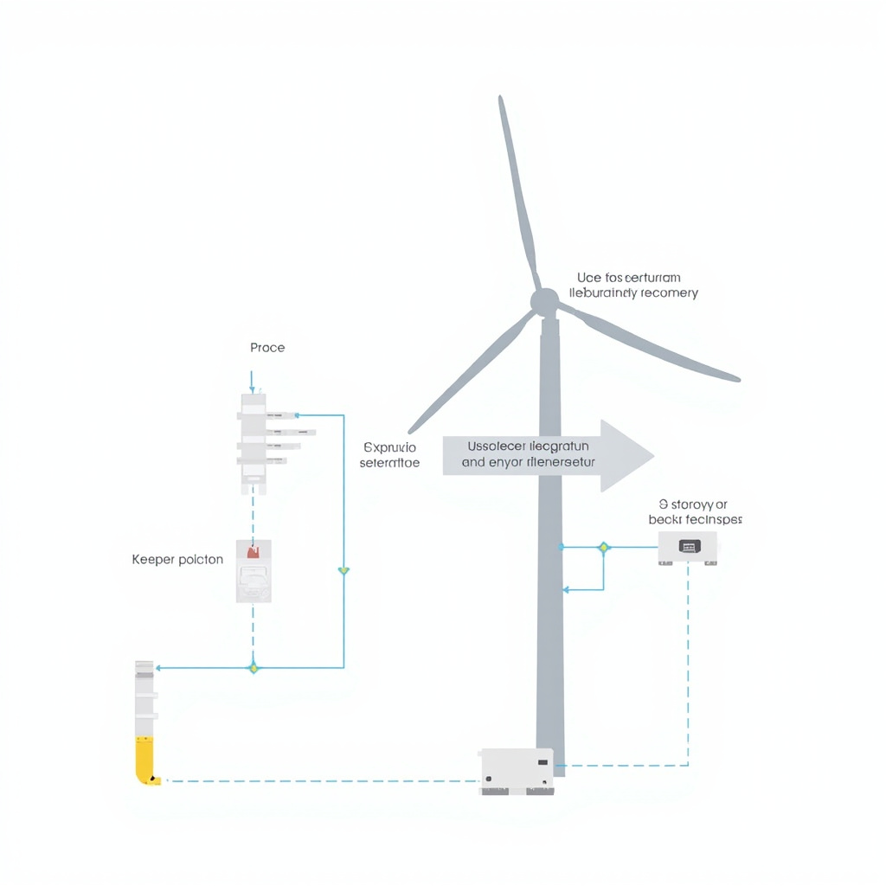
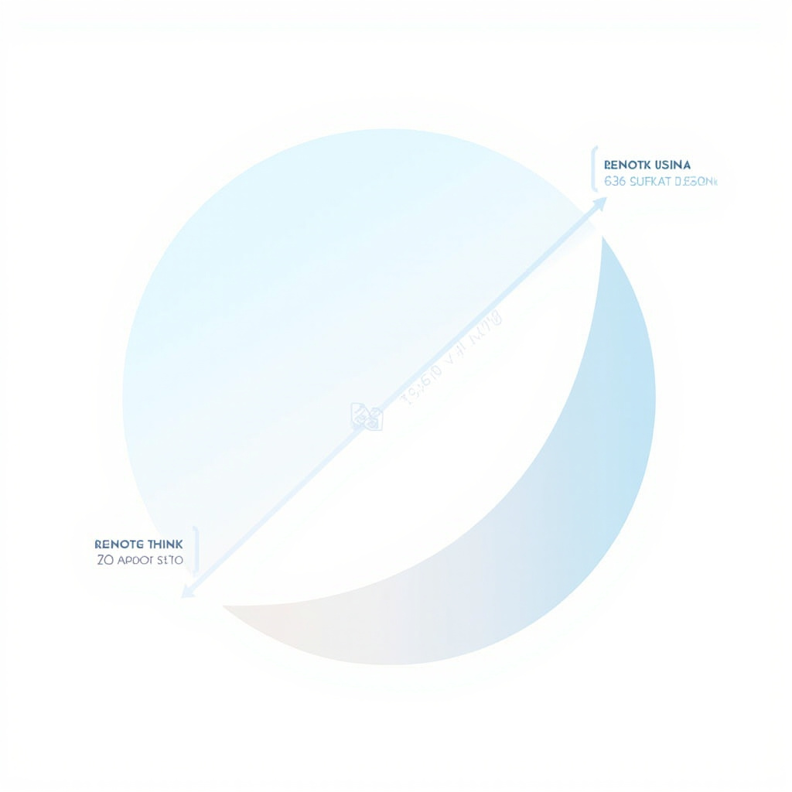

# 风力发电技术讲解

## 风力发电基本原理

### 风能转化机制

风力发电的核心在于将风能转化为机械能，再由机械能驱动发电机产生电能。风能来源于太阳辐射对地球大气层的不均匀加热，导致空气流动形成风。风携带的动能可以通过风力机叶片的旋转被捕获。 [展示风能如何通过风力机转化为机械能，再由发电机转换为电能的基本流程和物理原理](#block-IMAGE-1)

根据贝茨理论（贝兹极限），风力机捕获风能的理论极限为风中可用能量的59.3%，这一理论值为实际风力机设计提供了重要参考基准。该理论表明，即使在理想条件下，风力机也无法完全提取风的动能，超出这一限制的能量利用在物理上是不可能的。风力机的风能捕获效率主要受叶片设计、气动特性、风速分布以及发电机效率等多重因素综合影响。在实际应用中，现代风力机的风能捕获效率通常在30%至45%之间，远低于理论极限，这主要受到叶片磨损、传动系统损耗、控制策略限制以及湍流干扰等因素制约。当风流经叶片时，叶片的翼型结构在上下表面产生压力差，形成升力驱动叶片旋转。这一过程涉及复杂的空气动力学原理，包括升力系数、阻力系数以及失速特性等关键参数的理解与优化。

### 核心技术指标

评估风力发电系统的性能需要关注多个核心技术指标。风能利用率是衡量风力机将风能转化为机械能效率的关键参数，实际风力机的利用率通常在35%至45%之间。切入风速指风力机开始发电的最低风速，一般为3至4米每秒；切出风速则为风力机停止发电的最高风速，通常在25米每秒左右，以保护设备安全。

额定功率是风力机在额定风速下持续运行输出的最大功率，是评价风力发电机组的重

## 风力发电系统组成

风力发电系统是实现风能到电能转换的完整技术体系，主要由风力机结构和发电与控制系统两大核心部分构成，二者协同工作完成能量转换全过程。 [展示风力发电系统的主要组成部分及其相互关系，包括风力机结构、发电机、控制系统等关键部件的连接方式](#block-IMAGE-2)

### 风力机结构

风力机是实现风能捕捉的核心装置，主要由叶片、轮毂、主轴、齿轮箱和机舱等部件组成。叶片负责接收空气动能并将其转化为机械旋转力矩，其气动外形设计直接决定风能利用率。轮毂连接叶片与主轴，承受叶片传递的载荷并将其平稳传递至传动链。

主轴将轮毂的低速旋转传递至齿轮箱，齿轮箱通过增速作用使转速适应发电机需求。机舱包容上述所有部件并保护内部设备免受环境侵蚀。

### 发电与控制系统

发电系统以双馈异步发电机或永磁同步发电机为主，通过电磁感应原理将机械能转化为电能。双馈机型支持部分功率变流，具备较好的调速灵活性；永磁机型结构紧凑、效率较高。控制系统实时监测风速、转速、功率等关键参数，通过变桨和偏航控制优化能量捕获并确保设备安全运行。变桨系统调整叶片迎风角度以维持额定功率输出，偏航系统使机舱对正风向以最大化风能利用率。两大系统协调运作，共同实现风力发电的高效与可靠。

## 风力发电技术发展趋势

技术创新方向 [展示风力发电技术成本下降趋势、装机容量增长及效率提升的发展轨迹](#block-IMAGE-3)

当前风力发电技术正朝着多个方向快速演进。单机容量大型化是最显著的趋势之一，现代风电机组单机功率已从早期的数十千瓦发展到如今的10兆瓦以上，未来15兆瓦甚至20兆瓦级机组将成为主流。大型化不仅提高了发电效率，也显著降低了单位功率的建设和运维成本。

海上风电技术的突破为行业发展开辟了新空间。与陆上风电相比，海上风电具有风能资源丰富、单机容量大、发电利用小时数高等优势。近年来，漂浮式基础技术的成熟使得深远海风电开发成为可能，预计到2030年全球海上风电装机容量将增长数倍。

智能化运维技术正在重塑风电场的管理模式。通过物联网传感器、大数据分析与人工智能算法的结合，风电场能够实现设备的实时监测、故障预警与智能调度，显著提升了运维效率和设备可用率。

应用前景展望

从经济性角度看，风力发电成本持续下降趋势明显。过去十年间，陆上风电的平准化度电成本已降低约一半，与传统火电相比逐步接近甚至更具竞争力。未来随着技术进步和规模效应的持续叠加，风电成本仍将保持下降态势，预计到2035年风电将在更多地区实现与化石能源的平价上网。

风电的应用前景同样广阔。在全球能源转型和碳中和目标的双重驱动下，风电作为清洁、可再生的主力电源将在电力系统中扮演越来越重要的角色。无论是大型集中式风电基地还是分布式风电项目，都将迎来快速发展，为实现可持续发展目标贡献关键力量。