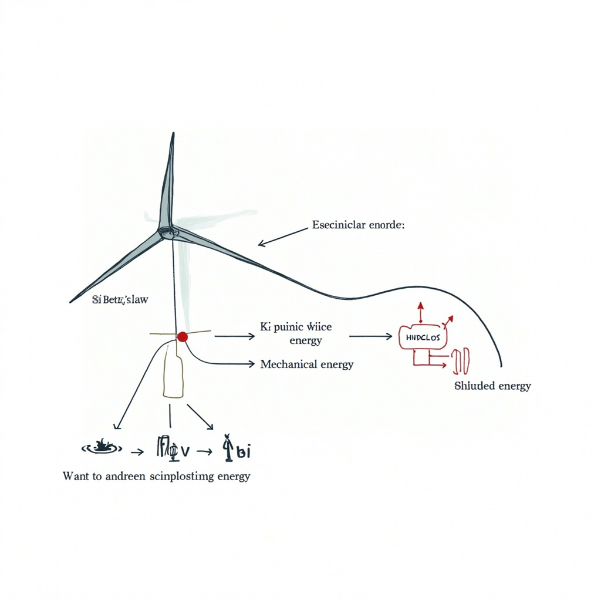
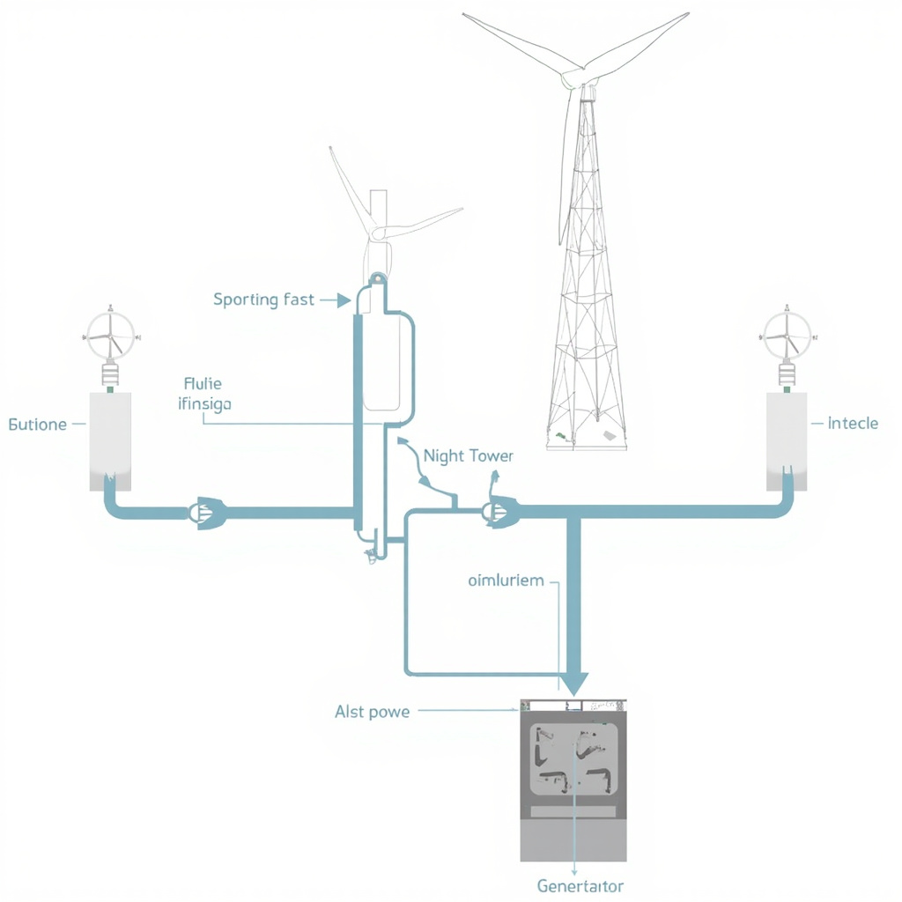

# 风力发电技术详解

## 风力发电基本原理

风能来源于太阳辐射导致的大气层不均匀受热，这种自然现象使地球表面不同区域产生气压差异，空气从高压区向低压区流动形成风。作为一种清洁可再生能源，风能具有储量丰富、分布广泛、无碳排放等显著优势，已成为全球能源结构转型的关键支柱之一。 [展示风力从风能转换为机械能再到电能的基本工作流程和转换机制，帮助读者直观理解贝茨理论的核心原理](#block-IMAGE-1)

### 风能转换机制

测试，风轮机从通过扫风面积的气流中提取的能量与气流动能成正比。风功率的计算公式为 **P \= ½ρAV³Cp**，其中 ρ 为空气密度，A 为扫风面积，V 为风速，Cp 为风能利用系数。根据贝茨理论，风力发电的理论最大效率约为 **59.3%**，这一极限被称为贝茨极限，意味着即使在最理想条件下，风轮机也只能提取流经风轮风能的大约六成能量。

### 风力发电机工作原理

当风通过风轮叶片时，气流的动能部分传递给叶片，气流压力在叶片的迎风面和背风面形成压力差，这种压力差产生旋转力矩，驱动轮毂以恒定转速旋转。通常，风轮叶片的转速范围为6至15转每分钟，属于低转速运转。现代风力发电机通常采用增速齿轮箱将较低的主轴转速提升至发电机所需的工作转速（一般为1500至1800转每分钟），或者采用直驱技术省去齿轮箱，利用多极永磁同步发电机直接输出较高频率的交流电。发电机转子在旋转磁场的驱动下切割磁感线产生感应电流，完成从机械能到电能的转换，整个过程的能量转换效率可达80%以上。为优化能量捕获并保护设备安全，变桨距系统通过液压或电动机构实时调节叶片迎风角度，使叶片在不同风速条件下都能保持最佳攻角，实现最大风能利用率；偏航系统则通过驱动电机控制机舱水平旋转，始终保持叶轮平面垂直于主风向。当风速超过机组额定容量时，变桨距系统会将叶片调整至顺桨位置，减小风能捕获，防止设备过载损坏。后续章节将详细讲解风力发电系统的具体组成结构。

## 风力发电系统组成

### 风轮机结构

风轮机是风力发电系统捕捉风能的核心装置，其结构设计直接决定机组的能量转换效率。叶片是风轮机最关键的部件，负责将流动空气的动能转换为旋转的机械能。现代大型风机叶片普遍采用碳纤维复合材料或玻璃纤维增强复合材料，通过空气动力学翼型设计，在保证结构强度的同时实现轻量化。叶片长度是衡量风机等级的重要指标，当前海上风机的叶片长度可达100米以上，扫风面积超过3万平方米。 [展示风力发电系统的核心组成部分及其相互关系，包括风轮、塔筒、发电机等关键部件的连接](#block-IMAGE-2)

轮毂连接叶片与主轴，承担传递载荷的关键作用，需具备足够的强度和疲劳寿命。主轴两端通过轴承支撑，使风轮能够灵活偏航以对准来流风向。轴承采用特大型滚动轴承，配合自动润滑系统确保长期稳定运行。塔筒作为支撑结构，不仅要承受风轮和叶片的重量，还需抵御强风产生的弯矩和振动。筒形设计在提供稳定支撑的同时显著减少材料用量，高度通常根据风场条件设计在80至140米之间。

### 发电与控制系统

发电与控制系统将风轮机捕获的机械能转换为电能，并实现机组的智能运维。齿轮箱承担增速传动的核心功能，将主轴的低转速高扭矩转换为发电机所需的高转速，传动比通常在1:80至1:100之间。双馈异步发电机和永磁同步发电机是当前主流机型，前者采用绕线式转子结构实现部分功率的变频控制，后者以永磁体励磁省去励磁系统，各有其技术优势。

控制系统是风电机组的神经中枢，基于SCADA平台实时采集风速、风向、转速、温度等运行参数。机组根据这些数据自动调节桨距角和发电机扭矩，实现最大功率点跟踪，确保在不同风速下均能高效运行。故障保护功能可在极端工况或设备异常时快速停机，保障机组安全。通过与电网调度系统联动，控制系统还能参与电力平衡和频率调节，为电网稳定运行提供支撑。

## 风力发电技术发展与应用

### 技术发展趋势

风力发电技术正经历前所未有的创新浪潮。当前，业内主要聚焦于三个关键方向：单机容量大型化、智能控制升级以及海上风电突破。

在大型化方面，主流机型已突破15MW，海上风机更向20MW级别迈进。正如前文所述的风轮机结构和发电控制系统持续优化，大尺寸风机为更高效的风能捕获奠定了硬件基础。与此同时，智能控制技术正在深度融入风电运维。通过人工智能算法和数字孪生技术，现代风机能够实现预测性维护，提前识别潜在故障，将非计划停机时间降至最低。

海上风电的发展同样令人瞩目。漂浮式基础技术的突破使深海域风能开发成为可能，传统的固定式基础受限于水深，而漂浮式平台则可部署在水深超过50米的区域，极大拓展了海上风电的资源版图。

### 应用现状与前景

全球风电装机容量持续攀升，风电已成为最具经济性的可再生能源之一。我国风电产业成就斐然，装机容量和新增装机均居世界首位，形成了完整的风电产业链。风电的环境效益同样显著，每千瓦时风电可减少约0.7千克二氧化碳排放，为应对气候变化做出重大贡献。

展望未来，储能技术结合、氢能制备以及跨季节调度等方向的发展将进一步提升风电消纳能力。随着技术持续进步和成本不断下降，风电将在全球能源转型中发挥更为关键的作用，清洁能源的美好前景值得期待。